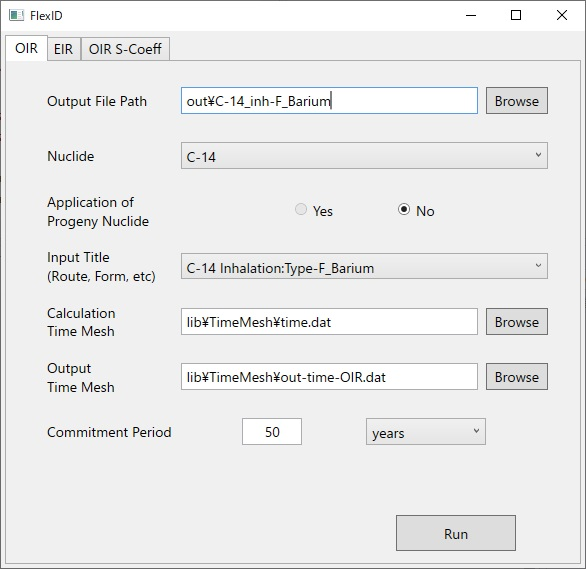

[Japanese](./Readme-ja.md)

# _FlexID (Flexible code for Internal Dosimetry)_

**FlexID** is a **calculation code** compatible with the **latest ICRP** (International Commission on Radiological Protection) **internal exposure dose assessment model** (Occupational Intakes of Radionuclides(**OIR**)).

The biokinetic model based on the ICRP 2007 recommendations is combined for each organ and tissue to calculate the transfer of radionuclides in the human body, including their progeny nuclides, to calculate time series data of residual radioactivity in the body, cumulative radioactivity in organs and tissues. Calculate time series data of excreted radioactivity in urine and feces, equivalent dose rate, equivalent dose, and committed effective dose.

FlexID is a general-purpose code that can change the combinations, connection paths, transfer coefficients, etc. of the biokinetic model (multicompartment model) simply by changing the input data, and can quickly respond to changes in the biokinetic model.
For example, applying the Japanese-specific iodine transfer coefficient to the thyroid gland to the Reference Person applied by ICRP can be easily done by simply changing the input data.

To confirm the validity of FlexID, we compared the calculation results of FlexID and ICRP (ICRP Publications 134, 137, 141) for the following nuclides and confirmed that they matched.

## Validation(OIR)

- **Target Nuclides**:
    H-3, C-14, Ca-45, Fe-59, Zn-65, Sr-90(Y-90), Tc-99, I-129, Ba-133, Cs-134, Cs-137(Ba-137m), Ra-223, Ra-226, Pu-238, Pu-239, Pu-240, Pu-241, Pu-242 (Progeny nuclides are in parentheses.)

- **Route of Intake**:
    Ingestion, Inhalation

- **Chemical Form**:
    All Chemical Forms for which biokinetic models are defined by ICRP for each element.

- **Calculation Results to be checked**:
    Residual radioactivity (Retention), Excreted radioactivity, Committed effective dose coefficient

## Validation(Members of the public : 3 months, 1, 5, 10, 15, 25 years old(*1))

Additionally, we implemented the current ICRP's calculation function for the "public" in FlexID on a trial basis, and confirmed the validity of the calculation results for ingestion of Sr-90. As a result, we confirmed that the calculation results of FlexID and ICRP generally matched.

- **Target Nuclides(*2)**:
Sr-90(Y-90)

- **Route of Intake**:
Ingestion

- **Calculation Results to be checked**:
    Residual radioactivity (Retention), Excreted radioactivity, Committed effective dose coefficient

**(*1)** : In most cases the adult is taken to be aged 20 y. Exceptions are made for the alkaline earth elements, lead, thorium, uranium, neptunium, plutonium, americium and curium. For these elements, the transfer rates for the adult apply to ages ≧25 y, because some of the transfer rates in the biokinetic models are equated with bone formation rates, which are expected to remain elevated up to about aged 25 y.

**(*2)** : ICRP Publ.30 (Part 1): Gastrointestinal tract model common to all elements (including nuclide transfer coefficient) / ICRP Publ.38: Nuclear decay data (Specific Effective Energy (SEE; S-coefficient in OIR) calculation by age) / ICRP Publ.60: Radiation weighting factors (used for SEE calculation) / ORNL/TM8381/V1-V7: Specific Absorbed Fraction (SAF) by age / ICRP Publ.67: Strontium and Yttrium Tissue systemic model (including nuclide transfer coefficient by age), f1 value (Absorption rate from the gastrointestinal tract into body fluids by age) / ICRP Publ.71: Rate of excretion from the bladder by age, Tissue weighting factors (used for SEE calculation), Organ/Tissue mass by age (used for SEE calculation)

## Program Structure

### _FlexID_

It consists of the following programs.

- **FlexID**

  Provides input GUI for FlexID.

- **FlexID.Calc**

  Executes FlexID calculation processing.

- **FlexID.Viewer**

  Visualize FlexID calculation results.

## Documentataion

[User manual (Japanese)](./docs/UserManual_jp.pdf).

## System Requirement

.NET Framework 4.6.2

## Screenshots

### _Input GUI_

### _Plot Diagram_ (Cs-137 (Type F: Fast absorption) 1 [Bq] Residual radioactivity (Retention) after inhalation)

### _Contour Animation_ (Cs-137 (Type F: Fast absorption) 1 [Bq] Equivalent dose after inhalation)

## References

### _OIR_
- [ICRP Publication 130](https://icrp.org/publication.asp?id=ICRP%20Publication%20130)
- [ICRP Publication 133](https://www.icrp.org/publication.asp?id=ICRP%20Publication%20133)
- [ICRP Publication 134](https://icrp.org/publication.asp?id=ICRP%20Publication%20134)
- [ICRP Publication 137](https://icrp.org/publication.asp?id=ICRP%20Publication%20137)
- [ICRP Publication 141](https://icrp.org/publication.asp?id=ICRP%20Publication%20141)
- [ICRP Publication 151](https://icrp.org/publication.asp?id=ICRP%20Publication%20151)

### _Members of the public_
- [ICRP Publication 30 (Part 1)](https://icrp.org/publication.asp?id=ICRP%20Publication%2030%20(Part%201))
- [ICRP Publication 38](https://icrp.org/publication.asp?id=ICRP%20Publication%2038)
- [ICRP Publication 56](https://icrp.org/publication.asp?id=ICRP%20Publication%2056)
- [ICRP Publication 60](https://icrp.org/publication.asp?id=ICRP%20Publication%2060)
- [ICRP Publication 67](https://icrp.org/publication.asp?id=ICRP%20Publication%2067)
- [ICRP Publication 69](https://icrp.org/publication.asp?id=ICRP%20Publication%2069)
- [ICRP Publication 71](https://icrp.org/publication.asp?id=ICRP%20Publication%2071)
- [ICRP Publication 72](https://icrp.org/publication.asp?id=ICRP%20Publication%2072)

## License

Copyright © MHI NS Engineering Co., Ltd.

**FlexID** is provided as-is under the **MIT license**. For more information, see [LICENSE](./LICENSE).

