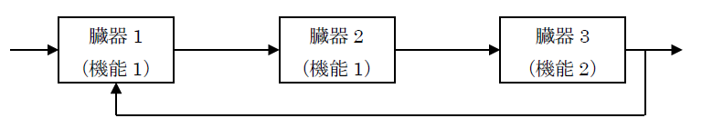
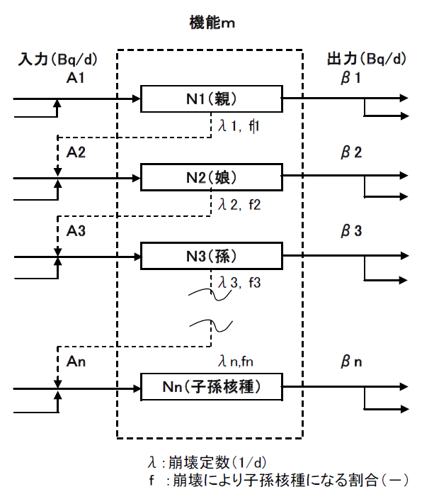
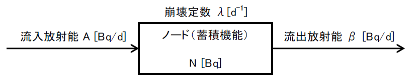
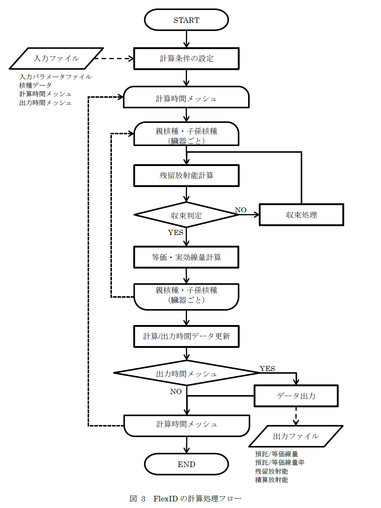

# 添付資料1 「体内残留放射能の計算方法」

# 1. FlexIDの体内残留放射能の計算方法

放射性物質摂取（経口摂取／吸入摂取）時の各臓器／器官／組織の放射性物質の放射能と被ばく線量をICRP OIRシリーズの体内動態モデルに基づき算出する内部被ばく線量評価コードFlexIDの計算方法を示す。

## 1.1 残留放射能計算方法の概要

1. 各臓器等を機能毎に分類し、その分類に基づき計算機能（入力（摂取：仮想ノードである摂取ノードにのみ設定可能）、混合、蓄積）を作成。その計算機能を組み合わせることで体内挙動モデルを形成する。

1. 計算は時間を分割し、先ず親核種について各臓器等の放射能が収束するまで繰り返し計算を行う。これを時間分割について行う。次に子孫核種について順次同様の収束計算を実施する。

    

    臓器1，2は計算機能1を、臓器3は計算機能2を使用する。

    臓器3から臓器2へ入力があるため、収束計算を行う。

    機能：入力、混合、蓄積（流入、流出、蓄積）、排出

1. 各計算機能は次図のように入力と出力に分けて取り扱う。子孫核種も同様に取り扱う。（子孫核種へ
の移行も臓器等の間での移行として取り扱う。）

    

1. 核種により体内での挙動が異なる場合の取扱
親核種と子孫核種で挙動が異なる場合（例えば、Te-131⇒I-131）は、核種の分類によりその流出先
を指定することで対応する。

## 1.2 基本計算式

以下の方法で体内の時系列放射能分布を計算する。

計算方法にはノード・ジャンクション法を採用し、臓器等の間での接続パス（ジャンクション）に設定された移行係数と移行割合から、各臓器等（ノード）の放射能を時間メッシュ毎に計算する。各時間メッシュにおいては、全てのノードの放射能が収束するまで繰り返し計算を実施する。

また、ノードは蓄積機能と混合機能のどちらかを選択でき、混合機能では複数の流入に対して平均値を計算し、その後、流出ジャンクションから移行割合に応じて流出させる。蓄積機能については、以下の基本式によりノード内の放射能の蓄積を計算する。

- 蓄積機能における前提条件

    

    流入放射能（$`A`$ \[Bq/d]）は時間メッシュ期間中一定と仮定する。

- 放射能$`N`$の計算

    $$\frac{\mathrm{d}N}{\mathrm{d}t} = A - (\lambda + \beta) \cdot N$$

    $$N = A \cdot \frac{1 - \exp{\{-(\lambda + \beta) \cdot t\}}}{\lambda + \beta} + N_0 \cdot \exp{\{-(\lambda + \beta) \cdot t\}}$$
 
ここで、

|式|意味|
|:--:|---|
|$`\lambda`$|崩壊定数 \[/d]|
|$`\beta`$|流出放射能 \[Bq/d]|
|$`N_0`$|当該時間メッシュにおける初期放射能 \[Bq]|

- 時間積分放射能$`Q`$の計算

$$\begin{align*}
    Q &= \int\limits_0^T N_i\ \mathrm{d}t \\
      &= N_0 \cdot            \frac{1 - \exp{\{ -(\lambda + \beta) \cdot T \}}}{\lambda + \beta}
       + A   \cdot \frac{ T - \frac{1 - \exp{\{ -(\lambda + \beta) \cdot T \}}}{\lambda + \beta} }{\lambda + \beta}
  \end{align*}$$

- 時間平均放射能$`\overline{N}`$の計算

$$\begin{align*}
    \overline{N} &= \frac{Q_i}{T} \\
                 &= N_0 \cdot            \frac{1 - \exp{\{ -(\lambda + \beta) \cdot T \}}}  {(\lambda + \beta) \cdot T}
                  + A   \cdot \frac{ 1 - \frac{1 - \exp{\{ -(\lambda + \beta) \cdot T \}}}  {(\lambda + \beta) \cdot T} }{\lambda + \beta}
  \end{align*}$$

ここで、

|式|意味|
|:--:|---|
|$`T`$|時間メッシュインターバル \[d]|

FlexIDの計算処理フローチャートを下図に示す。

# 2. 集合した臓器・組織の残留放射能の計算

ICRP Electronic Annex OIR Data Viewerで出力される「Whole Body」(全身)、「Alimentaryt Tract」(消化管)、「Lungs」(肺)、「Skeleton」(骨格)、「Liver」(肝臓)、「Thyroid」(甲状腺)の残留放射能データと比較可能な値を算出するための手法について示す。
なおここ示した "Blood fraction" については、OIR Data ViewerのHelpに記載されている。

- 「Whole Body」(全身)

    核種毎に、機能として`acc`が設定された各コンパートメンの残留放射能を合算した数値を出力する。

- 「Blood」(血液、輸送コンパートメント)

    核種毎に、線源領域として`Blood`が設定されたコンパートメントの残留放射能を合算した数値を出力する。

- 「Alimentary Tract」(消化管)

    核種毎に、線源領域として`St-cont`、`St-wall`、`SI-cont`、`SI-wall`、`RC-cont`、`RC-wall`、`LC-cont`、`LC-wall`、`RS-cont`、`RS-wall`
    が設定されたコンパートメントの残留放射能を合算し、これに「Blood」(血液)の残留放射能にBlood fractionとして`0.07`を掛けたものを加算した数値を出力する。

- 「Lungs」(肺)

    核種毎に、線源領域として`Bronchi`、`Bronchi-b`、`Bronchi-q`、`Brchiole`、`Brchiole-b`、`Brchiole-q`、`ALV`、`LN-Th`、`Lung-Tis`
    が設定されたコンパートメントの残留放射能を合算し、これに「Blood」(血液)の残留放射能にBlood fractionとして`0.125`を掛けたものを加算した数値を出力する。

- 「Skeleton」(骨格)

    核種毎に、線源領域として`C-bone-S`、`C-bone-V`、`T-bone-S`、`T-bone-V`、`C-marrow`、`T-marrow`、`R-marrow`、`Y-marrow`
    が設定されたコンパートメントの残留放射能を合算し、これに「Blood」(血液)の残留放射能にBlood fractionとして`0.07`を掛けたものを加算した数値を出力する。

- 「Liver」(肝臓)

    核種毎に、線源領域として`Liver`
    が設定されたコンパートメントの残留放射能を合算し、これに「Blood」(血液)の残留放射能にBlood fractionとして`0.1`を掛けたものを加算した数値を出力する。

- 「Thyroid」(甲状腺)

    核種毎に、線源領域として`Thyroid`
    が設定されたコンパートメントの残留放射能を合算し、これに「Blood」(血液)の残留放射能にBlood fractionとして`0.0006`を掛けたものを加算した数値を出力する。
