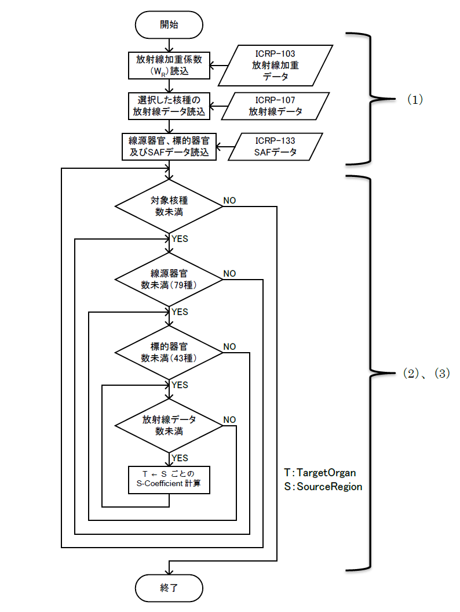
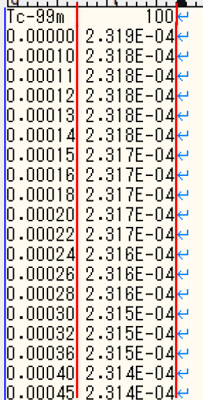
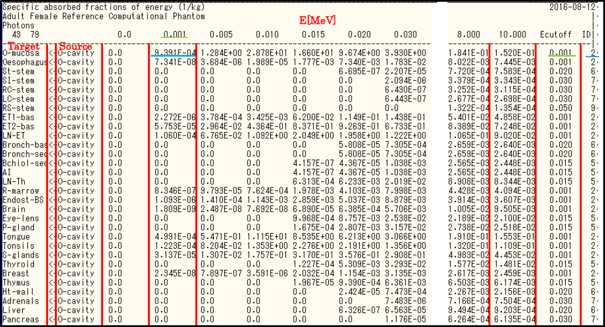
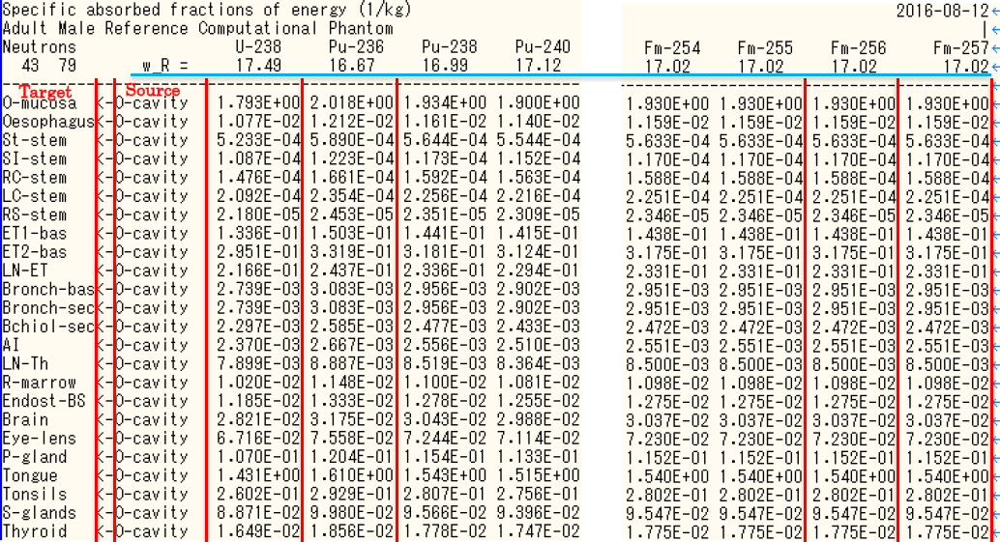

# 添付資料3 「S-Coefficientの計算方法」

# 1. はじめに

本資料は、ICRP Publ.133 SAFデータ及びICRP Publ.107核崩壊（放出放射線）データを用いて、S係数（S-Coefficient）を算出するための計算方法について説明する。

# 2. 概要

## 2.1 計算の流れ

1. 各パラメータ（放射線加重係数、放出放射線データ、SAFデータ）を読み込む。
1. 各パラメータを用いて、式(1)により線源器官から1つの標的器官へのS-Coefficientを計算する。
1. （2）を線源器官から標的器官の全てのパターン（79*43通り）について実施する。

図1にS-Coefficientプログラムの概略フローを示す。

図1 概略フロー図

## 2.2 使用データ

- ICRP Publ.103の放射線加重データ 1)
- ICRP Publ.107の核崩壊（放出放射線）データ 2)
- ICRP Publ.133のSAFデータ 3)

# 3 線源領域79×標的領域43個のS-Coefficient計算

ICRP Publ.133において公開された最新の比吸収割合（SAF）データから、以下の計算方法によりS–coefficientを算出する。

## 3.1 光子・単一エネルギー電子・α線

光子、単一エネルギー電子、及びα線の$`Y_i`$、$`E_i`$、及び$`w_{R_i}`$を用いて、次式から核種毎のS-Coefficientを計算する。

$$ S–coefficient(T ← S) = \sum_i ( Y_i * E_i * SAF(T ← S)\_i * w\_{R_i} )\ \mathrm{[MeV/kg/nt]} $$

ここで、

|式|意味|
|:--:|---|
|$`S–coefficient(T ← S)`$|ある核種がある線源臓器で1壊変したときの標的臓器1kg当たりに吸収されるエネルギー \[MeV/kg/nt]|
|$`Y_i`$|壊変あたりの放射線$`i`$の放出割合 \[/nt]|
|$`E_i`$|放射線$`i`$の平均または単一エネルギー \[MeV]|
|$`SAF(T ← S)_i`$|線源領域$`S`$𝑆内で放出されるエネルギー$`E_i`$の放射線から、標的領域$`𝑇`$`の単位質量あたりに吸収されるエネルギーの割合（比吸収割合） \[/kg]|
|$`w_{R_i}`$|放射線iの放射線加重係数 \[-]|

## 3.2 β－・β＋線スペクトル

β－、及びβ＋線スペクトルのS-Coefficientは、スペクトル全体で積分して、次式(2)から計算される。

$$ S–coefficient(T ← S) = w_R * \int_0^{E_{max}} Y(E) * E * SAF(T ← S,E) dE\ \mathrm{[MeV/kg/nt]} $$

ここで、

|式|意味|
|:--:|---|
|$`E`$|スペクトルデータ点のエネルギー \[MeV]|
|$`Y(E)`$|スペクトルデータ点E\[MeV]における壊変あたりのβ粒子の放出割合 \[/nt]|
|$`SAF(T ← S,E)`$|E\[MeV]における比吸収割合 \[/kg]|
|$`w_R`$|放射線R（電子、陽電）の放射線加重係数 \[-]|

## 3.3 自発核分裂中性子スペクトル

ICRP Publ.133では、自発核分裂中性子放出核種（28核種）については、核種毎に核分裂中性子スペクトルの平均エネルギーで正規化されたスペクトル平均のSAFが記載されている。従って、以下の方法により、核種毎のS-Coefficient (T←S)を計算することができる。

$$ S–coefficient(T ← S) = \overline{SAF(T ← S)} * \overline{W_R} \mathrm{[MeV/kg/nt]} $$

ここで、

|式|意味|
|:--:|---|
|$`\overline{SAF(T ← S)}`$|スペクトル平均の比吸収割合 \[/kg]|
|$`\overline{w_R}`$|対象核種におけるスペクトル平均の中性子の放射線加重係数 \[-]|

# 4 線源領域Other×標的領域43個のS-Coefficient計算

「その他の組織」`Other`を線源領域とするS-Coefficientの計算は、対象とする体内動態モデル図で明示されていないコンパートメントを決定する必要がある。
体内動態モデルはFlexIDのインプットに対応することから、FlexIDでは1つのインプットの計算処理に先立ってこのS-Cofficientを計算する必要がある。

具体的には、まずICRP Publ.133のSAFデータに含まれる`sregions_2016-08-12.NDX`にてID列が`1`となっている47個の「その他の組織」から、
FlexIDインプットにてコンパートメントに対応付けられている線源領域を除くことで、実際に「コンパートメントとして明示されていない」`Other`の内訳を求める。

次に、求めた`Other`の内訳と、それらの質量を用いて、次式から43個の標的領域それぞれへの$`S–coefficient(T ← Other)`$を計算する。

$$ S–coefficient(T ← Other) = \frac{1}{M_{Other}} \cdot \sum_S M_\mathrm{S} \cdot S–coefficient(T ← S) $$

ここで、

|式|意味|
|:--:|---|
|$`M_{Other}`$|コンパートメントモデルで明確にされていない組織の合計質量（ICRP Publ.133 TableA3.3 ※1）|
|$`M_\mathrm{S}`$|コンパートメントモデル図で明確にされていない個々の線源領域の質量|

# 5. ICRP Publication 103 放射線加重係数データ

ICRP Publication 103 に示されている放射線加重係数（WR）を表1 に示す。

表1 放射線加重係数

|放射タイプ|WR|
|--|--|
|光子|1|
|電子|1|
|α粒子|20|
|中性子|図2参照|

S-Coefficient計算の為の光子、電子及びα粒子のWRは表1に示す値を用いる。しかし、中性子については、ICRP Publ.133 のSAFデータにおいて、中性子スペクトル平均のWRが用いられている為、その値からS-Coefficientを計算する。

図2 中性子スペクトル平均の放射線加重係数

# 6. ICRP Publication 107 核崩壊データファイルの仕様

## 6.1 ICRP-07.RAD ファイル

`ICRP-07.RAD`ファイル（以下RADファイルと呼ぶ）には、放射性核種の壊変で放出された各放射線
のエネルギーと収率に関するデータが含まれている。このファイルの放射線にはカットオフエネルギー
が適用されていない。RADファイルのデータフィールドを表2 に示す。

表2 ICRP-07.RAD ファイルの構造

|フィールド|フォーマット|説明|
|---|---|---|
|_核種フィールド_|
|核種|A7|核種名 例：Tc-99m|
|半減期|E11.0|核種の物理的半減期|
|時間単位|A2|半減期の時間単位：μs-マイクロ秒、ms-ミリ秒、s-秒、m-分、d-日、y-年|
|N|I9|放射線データの数|
|_データフィールド_|
|ICODE|A2|放射線のタイプ（表 3 参照）|
|収率|E12.0|放射線の収率（/nt）|
|エネルギー|E12.0|放射線のエネルギー（MeV）|
|JCODE|A3|放射線のタイプ（表 3 参照）|

表2に示す核種フィールドには核種名、半減期、放射線データの数が記載されている。データフィールドは、放射線タイプを識別する整数コード（ICODE）、壊変あたりの放射線収率、放射線の固有エネルギーまたは平均エネルギー、放射線の種類を示す2 文字の簡易標記（JCODE）が記載されている。

- 光子-ICODE1-3 ：X線、γ線、消滅光子、即発及び遅発光子
- β粒子-ICODE4-5 ：各β遷移の平均エネルギー
- 電子-ICODE6-7 ：内部転換電子、オージェ電子
- α粒子-ICODE8
- α反跳核-ICODE9
- 核分裂片-ICODE10
- 中性子-ICODE11

表3 ICODE変数の説明

|ICODE|JCODE|説明|
|----|----|--|
| 1  | G  | γ線 |
|    | PG | 遅発γ線 |
|    | DG | 即発γ線 |
| 2  | X  | X線 |
| 3  | AQ | 消滅光子 |
| 4  | B+ | β+粒子 |
| 5  | B  | β粒子 |
|    | DB | 遅発β粒子 |
| 6  | IE | 内部転換電子 |
| 7  | AE | オージェ電子 |
| 8  | A  | α粒子 |
| 9  | AR | α反跳核 |
| 10 | FF | 核分裂断片 |
| 11 | N  | 中性子 |

Tc-99m の一部の核崩壊データのサンプルを図3 に示す。データフォーマットは表2 に従っており、データはエネルギーの小さい順に並んでいる。

図3 ICRP-07.RAD サンプル

## 6.2 ICRP-07.BET ファイル

`ICRP-07.BET`（以下、BETファイルと呼ぶ）には、RADファイルに含まれるβ粒子のスペクトルデータが含まれている。スペクトルデータは任意のエネルギー幅毎の積算値で示されている。核種フィールドには、核種毎に核種名とその核種の全放射線データが記録されている。データフィールドには、このエネルギー幅で放出される1壊変当たり、1MeV当たりの電子エネルギーE（MeV）とβ粒子の数が含まれている。BETファイルのデータフィールドを表4に示す。

表4 ICRP-07.BET ファイルの構造

|フィールド|フォーマット|説明|
|---|---|---|
|_核種フィールド_|
|核種|A7|核種名 例：Tc-99m|
|N|I10|データレコード数|
|_データフィールド（1…n）_|
|エネルギー|F7.0|エネルギーグリッドポイント（MeV）|
|β粒子数|E10.0|エネルギーにおける壊変1MeVあたりのβ粒子数|

図4 ICRP-07.BET サンプル

# 7. ICRP Publication 133 比吸収割合（SAF）データファイルの仕様

## 7.1 α粒子、電子および光子のSAF ファイル

α粒子、電子及び光子のSAFファイル名を表5に示す。

表5 α粒子、電子及び光子のSAFファイル名

|粒子|ファイル名|
|--|--|
|_女性_|
|α|rcp-af_alpha_2016-08-12.SAF|
|β|rcp-af_electron_2016-08-12.SAF|
|Γ|rcp-af_photon_2016-08-12.SAF|
|_男性_|
|α|rcp-am_alpha_2016-08-12.SAF|
|β|rcp-am_electron_2016-08-12.SAF|
|Γ|rcp-am_photon_2016-08-12.SAF|

ここで、AFは標準成人女性（Adult Female）、AMは標準成人男性（Adult Male）を表わす。それぞれのファイルには5つの見出しレコードがあり、6番目以降のレコードが対象となる全ての線源器官と標的器官に対応する全てのSAFレコードとなる。これらのファイルは、79の線源器官から43の標的器官に対するSAFが示されており、レコードの総数は43×79+5の3402である。ファイル内のレコードはすべて同じ長さである。電子と光子のレコードの長さは315で、αのSAFレコードの長さは270である。それに伴うキャリッジリターンとラインフィード（CrLf）は、これらの値に含まれていない。SAFファイルのデータフィールドを表6に示す。

表6 SAFファイル（α粒子、電子及び光子）の構造

|フィールド|フォーマット|説明|
|--|--|--|
|_1～3行目_||ファイルの説明|
|_4行目_|
|標的の数|I4|標的器官の数|
|線源の数|I4|線源器官の数|
|空白|空白14文字||
|放射線エネルギー|F10.5|SAF値に対する放射線エネルギー（1～n 個）|
|_5行目_||区切り線|
|_6行目以降_|
|標的器官|10文字|標的頭字語；例えばUB-wall|
|ダミー|2文字|記号「<-」|
|線源器官|10文字|線源頭字語；例えばUB-cont|
|SAF（１…n）|E10.0|n個のSAF値（kg-1）|
|Ecut|E10.0|ゼロでないSAFの最低エネルギー|
|Icut|I3|Ecutのエネルギー指数|
|CrLf|2文字|改行|

電子と光子のSAFファイルのエネルギー数nは28であり、αのSAFファイルは24のエネルギーについて示されている。前述のとおり、αのSAFファイルのEcutパラメータは長さが5（F5.0）である。

各ファイルの4番目のレコードは、SAFの値に対応する放射線エネルギーを表示するものである。エネルギーの単位はMeVである。

Icutフィールドには、ゼロでないSAF（T←S）値が示されているエネルギーの低エネルギー側からの順番が示されている。SAFがすべてゼロであれば、Icutは0に設定される。Icutがjであれば、レコードにはE（j）からE（n）までの範囲のエネルギーのゼロでないSAF値が含まれている。ここで、nは電子と光子のSAFファイルで28、αのSAFファイルで24である。つまりゼロでないSAF値の数は、n-j+1である。

図5 rcp-af_photon_2016-08-12.SAFサンプル

## 7.2 中性子のSAFファイル

中性子のSAFファイル名を表7に示す。

表7 中性子のSAFファイル名

|粒子|ファイル名|
|--|--|
|_女性_|
|N|rcp-af_neutron_2016-08-12.SAF|
|_男性_|
|N|rcp-am_neutron_2016-08-12.SAF|

ここで、AFは標準成人女性、AM標準成人男性を表わす。中性子のSAFファイルは、Publ.107（ICRP、2008年）にある自発核分裂崩壊モードの放射性核種に関する、43の標的器官と79の線源器官について、核分裂中性子スペクトルの平均エネルギーで正規化されたスペクトル平均のSAFを表示するものである。中性子のSAFファイルに示されている28の核種はU-238、Pu-236、Pu-238、Pu-240、Pu-242、Pu-244、Cm-240、Cm-242、Cm-244、Cm-245、Cm-246、Cm-248、Cm-250、Cf-246、Cf-248、Cf-249、Cf-250、Cf-252、Cf-254、Es-253、Es-254、Es-254m、Es-255、Fm-252、Fm-254、Fm-255、Fm-256、およびFm-257である。

これらのファイルの4番目のレコードは、Publ.103（ICRP、2007年）に示すスペクトル平均の中性子のWRを表示するものである。長さ302のSAFレコードのデータフィールドを表8に示す。

表8 SAFファイル（中性子）の構造

|フィールド|フォーマット|説明|
|--|--|--|
|_1～2行目_||ファイルの説明|
|_3行目_|
|線種|10文字|線種名（Neutron）|
|空白|空白14文字||
|核種|10文字|核種名；例えばU-238|
|_4行目_|
|標的の数|I4|標的器官の数（43）|
|線源の数|I4|線源器官の数（79）|
|WR記号|14文字|「W_R=」|
|放射線加重係数|F10.5|スペクトル平均の放射線加重係数|
|_5行目_||区切り線|
|_6行目以降_|
|標的器官|10文字|標的頭字語；例えばUB-wall|
|ダミー|2文字|記号「<-」|
|線源器官|10文字|線源頭字語；例えばUB-cont|
|SAF（1…28）|E10.0|28個のSAF値（kg-1）|
|CrLf|2文字|改行|

図6 rcp-am_neutron_2016-08-12.SAFサンプル

## 7.3 標的器官と線源器官の索引ファイル

ファイルtorgans_2016-08-12.NDXとsregions_2016-08-12.NDXにそれぞれ、SAFデータファイルと同じ順序で線源器官と標的器官が示されている。これらのSAFファイルには79の線源器官によって照射される43の標的器官のSAFデータが示されている。i番目の標的器官とj番目の線源器官のSAFファイルのレコードは、次式のとおりである。

ここで、43はこれらのファイルの中に記録されている標的器官の数の合計量である。例えば、脳はtorgans_2016-08-12.NDXファイルの18番目の標的器官であり、胃の内容物はsregions_2016-08-12.NDXファイルの10番目の線源領域である。したがって、SAF（Brain←St-cont）のレコード番号は43×9+23の410番目のレコードである。sregions_2016-08-12.NDXファイルのレコードには、線源器官の実質組織質量とその他の組織の線源器官の一部の領域を識別する「ID」フィールドがある（ID=1：「その他の組織の線源器官の一部」の対象、ID=0：対象外）。torgans_2016-0812.NDXファイルには、様々な標的器官の質量がある（図7参照）。

図7 sregions_2016-08-12.NDX及びtorgans_2016-08-12.NDXサンプル

表9 標的器官の名称

|略称|器官名|英名|
|--|--|--|
|O-mucosa|口腔粘膜|Oral mucosa|
|Oesophagus|食道|Oesophagus|
|St-stem|胃|Stomach|
|SI-stem|小腸|Small intestine|
|RC-stem|右結腸|Right colon|
|LC-stem|左結腸|Left colon|
|RS-stem|直腸S|状結腸 Rectosigmoid colon|
|ET1-bas|胸郭外領域1（ET1）基底細胞|Extrathoracic region1 basal cells|
|ET2-bas|胸郭外領域2（ET2）基底細胞|Extrathoracic region2 basal cells|
|LN-ET|胸郭外のリンパ節|Extrathoracic lymph nodes|
|Bronch-bas|気管支基底細胞|Bronchi basal cells|
|Bronch-sec|気管支分泌細胞|Bronchi secretory cells|
|Bchiol-sec|細気管支分泌細胞|Broncholar secretory cells|
|AI|肺胞間質|Alveolar-interstitial|
|LN-Th|胸部リンパ節|Thoracic lymph nodes|
|R-marrow|赤色（活性）骨髄|Red（active）marrow|
|Endost-BS|骨内膜の細胞|Endosteal cells|
|Brain|脳|Brain|
|Eye-lens|水晶体|Lens of eyes|
|P-gland|下垂体|Pituitary glang|
|Tongue|舌|Tongue|
|Tonsils|扁桃腺|Tonsils|
|S-glands|唾液腺|Salivary glands|
|Thyroid|甲状腺|Thyroid|
|Breast|乳房|Breast|
|Thymus|胸腺|Thymus|
|Ht-wall|心臓壁|Heart wall|
|Adrenals|副腎|Adrenals|
|Liver|肝臓|Liver|
|Pancreas|膵臓|Pancreas|
|Kidneys|腎臓|Kidneys|
|Spleen|脾臓|Spleen|
|GB-wall|胆嚢|Gall bladder|
|Ureters|尿管|Ureters|
|UB-wall|膀胱|Urinary bladder|
|Ovaries|卵巣|Ovaries|
|Testes|精巣|Testes|
|Prostate|前立腺|Prostate|
|Uterus|子宮|Uterus|
|LN-Sys|全身リンパ節|Systemic lymph nodes|
|Skin|皮膚|Skin|
|Adipose|脂肪組織|Adipose tissue|
|Muscle|筋肉|Muscle|

表10 線源器官の名称

|略称|器官名|英名|
|--|--|--|
|O-cavity|口腔|Oral cavity|
|O-mucosa|口腔粘膜|Oral mucosa|
|Teeth-S|歯表面|Teeth surface|
|Teeth-V|歯体積|Teeth volume|
|Tongue|舌|Tongue|
|Tonsils|扁桃腺|Tonsils|
|Oesophag-s|食道|slow Oesophagus – slow|
|Oesophag-f|食道|fast Oesophagus – fast|
|Oesophag-w|食道|Oesophagus|
|St-cont|胃内容物|Stomach contents|
|St-mucosa|胃粘膜|Stomach contents|
|St-wall|胃壁|Stomach wall|
|SI-cont|小腸内容物|Small intestine contents|
|SI-mucosa|小腸粘膜|Small intestine mucosa|
|SI-wall|小腸壁|Small intestine wall|
|SI-villi|小腸絨毛|Small intestine villi|
|RC-cont|右結腸内容物|Right colon content|
|RC-mucosa|右結腸粘膜|Right colon mucosa|
|RC-wall|右結腸壁|Right colon wall|
|LC-cont|左結腸内容物|Left colon content|
|LC-mucosa|左結腸粘膜|Left colon mucosa|
|LC-wall|左結腸壁|Left colon wall|
|RS-cont|直腸S|状内容物 Rectosigmoid colon content|
|RS-mucosa|直腸S|状粘膜 Rectosigmoid colon mucosa|
|RS-wall|直腸S|状壁 Rectosigmoid colon wall|
|ET1-sur|胸郭外領域1（ET1）表面|Extrathoracic region1 surface|
|ET2-sur|胸郭外領域2（ET2）表面|Extrathoracic region2 surface|
|ET2-bnd|胸郭外領域2（ET2）境界領域|Extrathoracic region2 bound region|
|ET2-seq|胸郭外領域2（ET2）隔離領域|Extrathoracic region2 sequestered region|
|LN-ET|胸郭外のリンパ節|Extrathoracic lymph nodes|
|Bronchi|気管支表面|Bronchial surface|
|Bronchi-b|気管支境界領域|Bronchial bound region|
|Bronchi-q|気管支隔離領域|Bronchial sequestered region|
|Brchiole|細気管支表面|Bronchiolar surface|
|Brchiole-b|細気管支境界領域|Bronchiolar bound region|
|Brchiole-q|細気管支隔離領域|Bronchiolar sequestered region|
|ALV|肺胞間質|Alveolar-interstitial|
|LN-Th|胸部リンパ節|Thoracic lymph nodes|
|Lungs|肺|Lungs|
|Adrenals|副腎|Adrenals|
|Blood|血液|Blood|
|C-bone-S|皮質骨表面|Cortical bone surface|
|C-bone-V|皮質骨|Cortical bone|
|T-bone-S|骨梁表面|Trabecular bone surface|
|T-bone-V|骨梁|Trabecular bone|
|C-marrow|皮質骨髄|Cortical bone marrow|
|T-marrow|骨梁骨髄|Trabecular bone marrow|
|R-marrow|赤色（活性）骨髄|Red（active）marrow|
|Y-marrow|黄色（非活性）骨髄|Yellow（inactive）marrow|
|Brain|脳|Brain|
|Breast|乳房|Breast|
|Eye-lens|水晶体|Lens of eye|
|GB-wall|胆嚢壁|Gall bladder|
|GB-cont|胆嚢内容物|Gall bladder content|
|Ht-wall|心臓壁|Heart wall|
|Kidneys|腎臓|Kidneys|
|Liver|肝臓|Liver|
|LN-Sys|全身リンパ節|Systemic lymph nodes|
|Ovaries|卵巣|Ovaries|
|Pancreas|膵臓|Pancreas|
|P-gland|下垂体|Pituitary gland|
|Prostate|前立腺|Prostate|
|S-glands|唾液腺|Salivary glands|
|Skin|皮膚|Skin|
|Spleen|脾臓|Spleen|
|Testes|精巣|Testes|
|Thymus|胸腺|Thymus|
|Thyroid|甲状腺|Thyroid|
|Ureters|尿管|Ureters|
|UB-wall|膀胱壁|Urinary bladder|
|UB-cont|膀胱内容物|Urinary bladder content|
|Uterus|子宮|Uterus|
|Adipose|脂肪|Adipose|
|Cartilage|軟骨|Cartilage|
|Muscle|筋肉|Muscle|
|ET1-wall|胸郭外領域1（ET1）壁|Extrathoracic region1 wall|
|ET2-wall|胸郭外領域2（ET2）壁|Extrathoracic region2 wall|
|Lung-Tis|肺組織|Lung tissue|
|RT-air|呼吸器の空気|Respiratory tract air|

## 8. 参考文献

1) ICRP: ”The 2007 Recommendations of the International Commission on Radiological Protection”
ICRP Publication 103 (2007)
2) ICRP: ”Nuclear Decay Data for Dosimetric Calculations” ICRP Publication 107 (2008)
3) ICRP: ”The ICRP computational framework for internal dose assessment for reference adults: specific absorbed fractions” ICRP Publication 133 (2016)