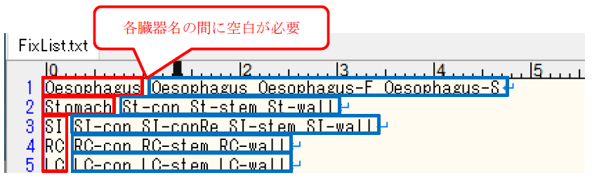

# 添付資料4 「インプットファイル等の作成方法」

# 1. インプットファイルの作成

インプットファイルは作成対象の核種が記載されているICRP OIR のfA 値および移行係数を参考とする。

作成したインプットは以下のように保存する。

- （例：Sr-90 の場合）

    `FlexID\inp\OIR\Sr-90`フォルダ内にインプットファイルを置く。

## 1.1 入力フォーマット

以下に入力フォーマットとサンプルインプットを示す。

|行番号|内容|備考|
|---|---|---|
|1|核種名|例：Cs-137|
|1|摂取経路/化学形態等|入力画面の「Route/Chemical Form」に表示され、識別される。 例：Inhalation:Type-F|
|1|崩壊定数 \[/day]|=ln(2)/半減期 \[day]|
|1|親核種からの分岐比 \[-]|親核種の場合は0 を入力|
|2以降|臓器番号|重複しない任意の番号|
|2以降|臓器名||
|2以降|臓器機能記号 ＜記号＞ ＜機能＞ inp：入力 acc：蓄積 mix：混合 exc：排出|排泄機能(exc)を設定するコンパートメントは、排泄先コンパートメントとなる。即ち、尿や糞などの排泄量を計算するコンパートメントに設定する。|
|2以降|臓器の生物学的半減期 \[/day]||
|2以降|流入元となる臓器の数||
|2以降|流入元となる臓器の臓器番号||
|2以降|流入元臓器からの流入割合||
|2以降|対象臓器のコンパートメントとS-Coefficient ファイルのS係数データとを紐づけるための臓器名称|lib フォルダに置く対象核種のS-Coefficientファイルの線源臓器の名称を入力する。また、OIR で「その他の臓器」として定義されているコンパートメントには、線源臓器の名称として「Other」を入力する。なお、S-Coefficientファイルで線源臓器となっていないコンパートメントには名称として「-」を入力する。|
|最終行|end：入力終了 |cont：子孫核種の情報を継続して入力|子孫核種を考慮する場合、「cont」以降に親核種同様の情報を入力する。（`FlexID\inp\OIR\Sr-90\Sr-90_ing-Other.inp`を参照）|

## 1.2 生物学的半減期および移行割合の計算方法

コンパートメント毎の生物学的半減期およびコンパートメント間における移行割合の導出方法を示す。コンパートメント間の移行割合の導出方法は、全ての核種で共通となる。

次表にコンパートメント間の移行係数の例を示す。

|From|To|移行係数 \[/d]|
|:-:|:-:|:-:|
|Oralcavity|Oesophagus-F|6480|
|Oralcavity|Oesophagus-S|720|
|Oesophagus-F|Stomach-con|12343|
|Oesophagus-S|Stomach-con|2160|

Oralcavity を例とすると

- Oralcavityの生物学的半減期

    ＝ Oralcavityからの全ての流出（Publ.130 Table3.4参照）

    ＝ Oesophagus-Fへの流出\[6480] + Oesophagus-S \[720]

    ＝ 7200 /d

消化管から血液への吸収を伴う場合の生物学的半減期及び移行割合を導出する場合は、消化管から血液への吸収割合を示すfA 値を考慮する必要がある。

次表に消化管から血液への吸収割合を示すfA値の例を示す。

<table>
<caption>表2　消化管から血液への吸収割合を示すfA値の例</caption>
<tr><th rowspan="2">Inhaled particulate materials</th><th colspan="3">Absorption parameter values</th><th>Absorption from the alimentary</th></tr>
<tr><th>fr</th><th>sr (/d)</th><th>ss (/d)</th><th>tract (fA)</th></tr>
<tr><th>F</th> <td>1</td>    <td>100</td> <td></td>       <td>1</td></tr>
<tr><th>M</th> <td>0.2</td>  <td>3</td>   <td>0.005</td>  <td>0.2</td></tr>
<tr><th>S</th> <td>0.01</td> <td>3</td>   <td>0.0001</td> <td>0.01</td></tr>
<tr><th colspan="5">Ingested materials</td></tr>
<tr><th>All forms</th><td>-</td><td>-</td><td>-</td><td>0.1</td></tr>
</table>

fA値（SI からBlood への吸収値）を伴う場合の生物学的半減期及び移行割合の計算方法

SI-con からBlood への移行割合は、fA=0.1 より10%となり、「SI-con」から「Blood」への移行係数は、下記の方法で導出する。

- SI-con の生物学的半減期

   ＝ Blood を除くSI-con からの全ての流出 + （fA 値 × SI-con → R-colon への流出）／（1－fA 値）

   ＝ 6 +（0.1×6）／（1-0.1）

   ＝ 6 + 0.6／0.9

   ＝ 6.6667 /d

- SI-con からBlood への移行割合

   ＝ Blood への流出 ／ SI-con からの全ての流出

   ＝ 0.6667 ／ 6.6667

   ＝ 0.1 ＝ 10％

# 2. S-Coefficientファイルの作成

## 2.1 事前準備

1. `S-Coefficient`フォルダを任意のフォルダにコピーする。

1. `S-Coefficient\ S-Coefficient.exe`をダブルクリックして起動。

1. `S-Coefficient\lib\NuclideList.txt`を開き、計算対象とする核種名（例：Sr-90、計算対象とする核種は`ICRP-07.RAD`ファイルに記載されている核種のみ）を入力後、保存して閉じる。なお、複数核種の計算を実施する場合は、1核種毎に改行して入力する（図1参照）。

    

1. 計算方法を選択し、男性と女性の2回の計算を実行する。

1. `S-Coefficient\out`に計算結果が出力される。※ S-Coefficientプログラム（`S-Coefficient.exe`）の詳細仕様については[添付資料4](UserManual_Appendix-4.md)を参照。

## 2.2 S-Coefficientの算出

Sr-90を例に説明する：

1. `S-Coefficient計算.xlsx`を開く。このとき、Excel内のG29:CI72の表を表1、CL29:FL72の表を表2、FO29:IQ72の表を表3、IT29:LT72の表を表4とする。

1. 2.1節で計算した`Sr-90_AdultMale.xlsx`の「total」シートの値部分のみを表2に、`Sr-90_AdultFemale. xlsx`の「total」シートの値部分のみを表4に貼り付ける。

1. 表1の「Other」列を基準にSr-90のコンパートメントモデルに明示されている臓器の列を「Other」列よりも左側に、コンパートメントモデルにない臓器を右側に列ごと移動（Excel列の「切り取り」→「切り取ったセルの挿入」）させる（図 2を参照）。この時、「骨（T-bone-S, T-bone-S, C-bone-V, C-bone-V）」が右側に移動した場合は対象外とする（「Other」列のセルの計算から除く）。

    

1. G:29からOtherの最終行までをテキストファイルに貼り付け、`Sr-90_AM_S-Coefficient.txt`（`<核種名>_<性別>_S-Coefficient.txt`, 子孫核種の場合：`<核種名>_<性別>_prg_S-Coefficient.txt`）として保存。

1. 表3にも同様の処理をして`Sr-90_AF_S-Coefficient.txt`として保存。

2.3 S-Coefficientの後処理

1. 2章で作成したテキストファイルを`PostProcessing¥file`フォルダに移動する。

1. `PostProcessing\PostProcessing.exe`をダブルクリックすると`PostProcessing\file`フォルダにあるテキストファイルがFlexIDで使用できるフォーマットに変換される（※元々あったテキストファイルは上書きされるため要注意）。成型前のテキストを図3、成型後のテキストを図4に示す。

    

    

1. 変換後のファイルを`FlexID\lib\OIR`フォルダに移動してS-Coefficientファイルの作成は完了となる。

# 3. タイムメッシュファイルの作成

タイムメッシュファイルのフォーマットを以下に示す。

時間は小数点以下6桁の指数で表示されており、単位は\[day]。並び順は昇順。

※ 出力タイムメッシュを作成する際は、出力タイムメッシュが計算タイムメッシュに含まれていることを確認する。（含まれていない場合は、計算エラーとなる。）

（上図は、6.944444E-04, 1.388889E-03, 2.083333E-03,･･･の順にタイムメッシュが並ぶ。

以下のように上から順に一列のフォーマットにも対応している。

# 4. 臓器名称統一ファイルの編集

臓器名称統一ファイルである`lib\FixList.txt`のフォーマットを以下に示す。

このファイルを参照し、「FlexID結果表示画面(Model)」に結果が出力される。

赤枠内に記載された名称が統一後の名称、青枠内に記載された名称が統一前の名称であり、これらの積算値が赤枠内の統一名称の結果として出力される。

