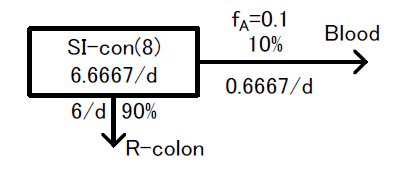
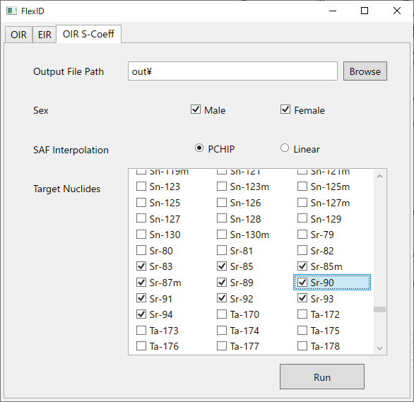
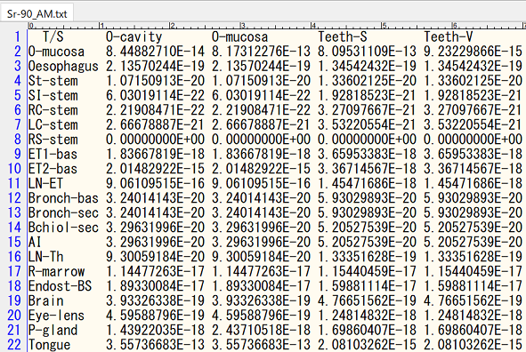

# 添付資料4 「インプットファイル等の作成方法」

# 1. インプットファイルの作成

インプットファイルは作成対象の核種が記載されているICRP OIR のf<sub>A</sub> 値および移行係数を参考とする。

作成したインプットは以下のように保存する。

- （例：Sr-90 の場合）

    `FlexID\inp\OIR\Sr-90`フォルダ内にインプットファイルを置く。

## 1.1 入力フォーマット

以下に入力フォーマットを示す。

インプットにおいて空行は意味を持たず、単に無視される。

行内に`#`文字が出現する場合、それ以降の文字列はコメントとして扱われ、無視される。

インプットはセクションによる区分けが行われ、`[` + *セクション名* + `]`という行がその始まりとなる。

| セクション名            | 内容                                                                 |
| ----------------------- | -------------------------------------------------------------------- |
| `title`                 | インプットのタイトルテキストを設定する。                             |
| `nuclide`               | インプットで計算対象とする核種を設定する。                           |
| `parameter`             | インプット全体に対するパラメータを設定する。                         |
| 核種名 + `:parameter`   | 当該核種に対するパラメータを設定する。                               |
| 核種名 + `:compartment` | 当該核種の体内動態モデルにおいて使用するコンパートメントを設定する。 |
| 核種名 + `:transfer`    | 当該核種の体内動態モデルにおけるコンパートメント間の移行を設定する。 |

### 1.1.1 `nuclide`セクション

インプットで計算対象とする核種を設定する。親核種は1行目に記述し、存在する場合は子孫核種を2行目以降に記述できる。

各行は次表で示す4つの列で構成される。

| 列番号 | 内容                    | 備考                                                      |
| ------ | ----------------------- | --------------------------------------------------------- |
| 1      | 核種名                  | 線量計算のためのS係数データと対応する。例：`Cs-137`       |
| 2      | 崩壊定数λ \[/day]      | =ln(2)/半減期 \[day]                                      |
| 3      | 親核種からの分岐比 \[-] | 親核種の場合は0 を入力する。                              |

### 1.1.2 `parameter`セクション

計算処理に関する各種のパラメータを指定する。セクション名に核種名を含める場合は当該核種を対象として、
そうでない場合はインプット全体を対象としてパラメータ設定を行う。

| パラメータ名                | 対象       | 内容                                                             |
| --------------------------- | ---------- | ---------------------------------------------------------------- |
| `ExcludeOtherSourceRegions` | 全体, 核種 | 線源領域`Other`の内訳から除外する線源領域を空白区切りで並べる。  |
| `IncludeOtherSourceRegions` | 全体, 核種 | 線源領域`Other`の内訳として含める線源領域を空白区切りで並べる。  |

### 1.1.3 `compartment`セクション

当該核種の体内動態モデルにおいて使用するコンパートメントを設定する。

1行につき1個のコンパートメントを設定でき、各行は次表で示す3つの列で構成される。

| 列番号 | 内容                   | 備考                                                  |
| ------ | ---------------------- | ----------------------------------------------------- |
| 1      | コンパートメント機能   | `inp`：入力、 `acc`：蓄積、 `mix`：混合、 `exc`：排泄 |
| 2      | コンパートメント名     |                                                       |
| 3      | 対応する線源領域の名称 | 線源領域に対応しない場合は「-」を入力する。           |

コンパートメント機能の詳細は以下の通り。

- `inp`：摂取した放射能を初期配分するための移行元として、親核種に1つだけ定義する。
- `acc`：流入した放射能の蓄積と、時間経過による流出および壊変による減衰を計算する。
- `mix`：流入した放射能の割合による再配分を行う。流出は瞬時に行われるものとして計算される。
- `exc`：体外への排泄、即ち、尿や糞などの排泄量を計算する。

対応する線源領域の名称は、当該コンパートメントの残留放射能から線量を計算する際に使用されるため、
`lib/OIR/Scoeff`フォルダに置く対象核種のS-Coefficientファイルに列挙された線源領域の名称である必要がある。
OIRで「その他の組織」として線量を計算する場合は、名称として「Other」を設定する。
コンパートメントが線源領域に対応しない場合は「-」を入力する。
                                                                                                 
### 1.1.4 `transfer`セクション

当該核種の体内動態モデルにおけるコンパートメント間の移行を設定する。

1行につき1個の移行経路を設定でき、各行は次表で示す3つの列で構成される。

| 列番号 | 内容                                            | 備考                                                               |
| ------ | ----------------------------------------------- | ------------------------------------------------------------------ |
| 1      | 移行元のコンパートメント名                      | 親核種にあるコンパートメントは、先頭に「核種名 + `/`」を付加する。 |
| 2      | 移行先のコンパートメント名                      |                                                                    |
| 3      | 移行係数：<br>移行速度\[/d] または 移行割合\[%] | 壊変による移行経路の場合は「-」を入力する。                        |

時間経過を伴う移行には移行速度\[/d]を設定し、これは一般的に、OIRに定義された数値をそのまま入力することができる。
蓄積計算を行う`acc`からの流出には、移行速度での設定が必要となる。

時間経過を伴わない瞬時に行われる移行には、移行元から流出する放射能に対する移行割合\[%]を設定する。この時、数値の末尾には百分率であることを示す`%`を付加する。初期配分である`inp`からの流出、および合算と再配分を行う`mix`からの流出には、移行割合での設定が必要となる。

親核種からの壊変による移行は、体内の同一領域にて放射性物質が移動せずに瞬時に行われるものとして計算されるため。移行係数として「-」を設定する。

移行元と移行先の両方が一致する複数の同一経路、移行先が移行元と同じ経路、`inp`への流入経路、`exc`からの流出経路、といった、不正な経路の定義はエラーとなる。

### 1.1.5 インプットのサンプル

```
[title]
Sr-90 Ingestion:Other

[nuclide]
# Nuclide | λ=ln(2)/t½[/d]   | Branching Fraction
#---------+-------------------+---------------------
  Sr-90     6.596156E-05        0.0
  Y-90      2.595247E-01        1.0


[Sr-90:compartment]
#-----+---------------------| S-Coefficient
# Func| Compartment         | Source Region
#-----+---------------------+---------------
  inp   input                 ---
  acc   Oralcavity            O-cavity
  acc   Oesophagus-F          Oesophag-f
  acc   Oesophagus-S          Oesophag-s
  acc   St-con                St-cont
  acc   SI-con                SI-cont
  acc   RC-con                RC-cont
  acc   LC-con                LC-cont
  acc   RS-con                RS-cont
  exc   Faeces                ---
  acc   Blood1                Blood
  acc   ST0                   Other
  acc   ST1                   Other
  acc   ST2                   Other
  acc   C-bone-S              C-bone-S
  acc   Exch-C-bone-V         C-bone-V
  acc   Noch-C-bone-V         C-bone-V
  acc   T-bone-S              T-bone-S
  acc   Exch-T-bone-V         T-bone-V
  acc   Noch-T-bone-V         T-bone-V
  acc   UB-con                UB-cont
  exc   Urine                 ---

[Sr-90:transfer]
#-----------------------+---------------------+--------------
# From                  | To                  | Coefficient[/d] or [%]
#-----------------------+---------------------+--------------

  input                   Oralcavity              100.0%

# ICRP Publ.130 p.76 Table 3.4 & footnote
  Oralcavity              Oesophagus-F           6480
  Oralcavity              Oesophagus-S            720
  Oesophagus-F            St-con                12343
  Oesophagus-S            St-con                 2160
  St-con                  SI-con                   20.57
  SI-con                  RC-con                    6
  RC-con                  LC-con                    2
  LC-con                  RS-con                    2
  RS-con                  Faeces                    2

# ICRP Publ.134 p.215 Table 10.2
#   fA = 0.25   (Ingested material, All other chemical forms)
#   λ(SI->Blood) = fA*λ(SI->RC)/(1-fA) = 0.25 * 6 / (1 - 0.25) = 2
  SI-con                  Blood1                    2

# ICRP Publ.134 p.220 Table 10.3
  Blood1                  UB-con                    1.73
  Blood1                  RC-con                    0.525
  Blood1                  T-bone-S                  2.08
  Blood1                  C-bone-S                  1.67
  Blood1                  ST0                       7.5
  Blood1                  ST1                       1.5
  Blood1                  ST2                       0.003
  T-bone-S                Blood1                    0.578
  T-bone-S                Exch-T-bone-V             0.116
  C-bone-S                Blood1                    0.578
  C-bone-S                Exch-C-bone-V             0.116
  ST0                     Blood1                    2.50
  ST1                     Blood1                    0.116
  ST2                     Blood1                    0.00038
  Exch-T-bone-V           T-bone-S                  0.0043
  Exch-T-bone-V           Noch-T-bone-V             0.0043
  Exch-C-bone-V           C-bone-S                  0.0043
  Exch-C-bone-V           Noch-C-bone-V             0.0043
  Noch-C-bone-V           Blood1                    0.0000821
  Noch-T-bone-V           Blood1                    0.000493

# ICRP Publ.130 p.85 Para.172
  UB-con                  Urine                    12


[Y-90:compartment]
#-----+---------------------| S-Coefficient
# Func| Compartment         | Source Region
#-----+---------------------+---------------
  acc   Oralcavity            O-cavity
  acc   Oesophagus-F          Oesophag-f
  acc   Oesophagus-S          Oesophag-s
  acc   St-con                St-cont
  acc   SI-con                SI-cont
  acc   RC-con                RC-cont
  acc   LC-con                LC-cont
  acc   RS-con                RS-cont
  exc   Faeces                ---
  acc   Blood1                Blood
  acc   Blood2                Blood
  acc   ST0                   Other
  acc   ST1                   Other
  acc   Liver0                Liver
  acc   Liver1                Liver
  acc   Kidneys               Kidneys
  acc   C-bone-S              C-bone-S
  acc   C-bone-V              C-bone-V
  acc   T-bone-S              T-bone-S
  acc   T-bone-V              T-bone-V
  acc   UB-con                UB-cont
  exc   Urine                 ---

[Y-90:transfer]
#-----------------------+---------------------+--------------
# From                  | To                  | Coefficient[/d or %]
#-----------------------+---------------------+--------------

# from parent to progeny
  Sr-90/Oralcavity        Oralcavity                ---
  Sr-90/Oesophagus-F      Oesophagus-F              ---
  Sr-90/Oesophagus-S      Oesophagus-S              ---
  Sr-90/St-con            St-con                    ---
  Sr-90/SI-con            SI-con                    ---
  Sr-90/RC-con            RC-con                    ---
  Sr-90/LC-con            LC-con                    ---
  Sr-90/RS-con            RS-con                    ---
  Sr-90/Faeces            Faeces                    ---
  Sr-90/Blood1            Blood1                    ---
  Sr-90/ST0               ST0                       ---
  Sr-90/ST1               ST0                       ---
  Sr-90/ST2               ST0                       ---
  Sr-90/C-bone-S          C-bone-S                  ---
  Sr-90/Exch-C-bone-V     C-bone-V                  ---
  Sr-90/Noch-C-bone-V     C-bone-V                  ---
  Sr-90/T-bone-S          T-bone-S                  ---
  Sr-90/Exch-T-bone-V     T-bone-V                  ---
  Sr-90/Noch-T-bone-V     T-bone-V                  ---
  Sr-90/UB-con            UB-con                    ---
  Sr-90/Urine             Urine                     ---

# ICRP Publ.130 p.76 Table 3.4 & footnote
  Oralcavity              Oesophagus-F           6480
  Oralcavity              Oesophagus-S            720
  Oesophagus-F            St-con                12343
  Oesophagus-S            St-con                 2160
  St-con                  SI-con                   20.57
  SI-con                  RC-con                    6
  RC-con                  LC-con                    2
  LC-con                  RS-con                    2
  RS-con                  Faeces                    2

# ICRP Publ.134 p.242 Table 11.2
#   fA = 1E-4   (Ingested material, All chemical forms)
#   λ(SI->Blood) = fA*λ(SI->RC)/(1-fA) = 1E-4 * 6 / (1 - 1E-4) = 6.000600060006001E-4
  SI-con                  Blood1                    6.000600060006001E-4

# ICRP Publ.134 p.252 Table 11.3
  Blood1                  Blood2                    0.498
  Blood1                  Liver0                    1.66
  Blood1                  Kidneys                   0.166
  Blood1                  ST0                       3.652
  Blood1                  ST1                       1.328
  Blood1                  UB-con                    2.49
  Blood1                  SI-con                    0.166
  Blood1                  T-bone-S                  3.32
  Blood1                  C-bone-S                  3.32
  Blood2                  Blood1                    0.462
  Liver0                  SI-con                    0.0231
  Liver0                  Blood1                    0.0924
  Liver0                  Liver1                    0.116
  Liver1                  Blood1                    0.0019
  Kidneys                 Blood1                    0.0019
  ST0                     Blood1                    0.231
  ST1                     Blood1                    0.0019
  T-bone-S                Blood1                    0.000493
  T-bone-S                T-bone-V                  0.000247
  T-bone-V                Blood1                    0.000493
  C-bone-S                Blood1                    0.0000821
  C-bone-S                C-bone-V                  0.0000411
  C-bone-V                Blood1                    0.0000821

# ICRP Publ.130 p.85 Para.172
  UB-con                  Urine                    12
```

## 1.2 移行係数の設定方法

吸入摂取における呼吸器への初期配分割合と、これをインプットとして設定する例を示す。

| Region         | Deposition (%) |
| -------------- | -------------- |
| ET<sub>1</sub> | 47.94          |
| ET<sub>2</sub> | 25.82          |
| BB             | 1.78           |
| bb             | 1.10           |
| AI             | 5.32           |
| Total          | 81.96          |

```
[Sr-90:transfer]
...
# ICRP Publ.130 p.62 Table 3.1
# ICRP Publ.130 p.64 Para.98
# ICRP Publ.130 p.65 Fig.3.4 footnote
# ICRP Publ.134 p.215 Table 10.2
# f_r = 1 (100%)
  input       ET1-F            47.94%       # =          47.94%
  input       ET2-F            25.76836%    # = 99.8% of 25.82%
  input       ETseq-F           0.05164%    # =  0.2% of 25.82%
  input       BB-F              1.77644%    # = 99.8% of  1.78%
  input       BBseq-F           0.00356%    # =  0.2% of  1.78%
  input       bb-F              1.0978%     # = 99.8% of  1.10%
  input       bbseq-F           0.0022%     # =  0.2% of  1.10%
  input       ALV-F             5.32%       # =           5.32%
  input       Environment      18.04%       # = 100% - 81.96%
```

コンパートメント間の移行係数の例と、これをインプットとして設定する例を示す。

|     From     |      To      | 移行速度\[/d] |
| :----------: | :----------: | :-----------: |
|  Oralcavity  | Oesophagus-F |     6480      |
|  Oralcavity  | Oesophagus-S |      720      |
| Oesophagus-F | Stomach-con  |     12343     |
| Oesophagus-S | Stomach-con  |     2160      |

```
[Sr-90/transfer]
...
Oralcavity      Oesophagus-F     6480
Oralcavity      Oesophagus-S      720
Oesophagus-F    Stomach-con     12343
Oesophagus-S    Stomach-con      2160
```

消化管から血液への吸収を伴う場合の生物学的半減期及び移行割合を導出する場合は、消化管から血液への吸収割合を示すf<sub>A</sub>値を考慮する必要がある。

次表に消化管から血液への吸収割合を示すf<sub>A</sub>値の例を示す。

<table>
<tr><th rowspan="2">Inhaled particulate materials</th><th colspan="3">Absorption parameter values</th><th>Absorption from<br>the alimentary</th></tr>
<tr><th>f<sub>r</sub></th><th>s<sub>r</sub> (/d)</th><th>s<sub>s</sub> (/d)</th><th>tract (f<sub>A</sub>)</th></tr>
<tr><th>F</th> <td>1</td>    <td>100</td> <td></td>       <td>1</td></tr>
<tr><th>M</th> <td>0.2</td>  <td>3</td>   <td>0.005</td>  <td>0.2</td></tr>
<tr><th>S</th> <td>0.01</td> <td>3</td>   <td>0.0001</td> <td>0.01</td></tr>
<tr><th colspan="5">Ingested materials</td></tr>
<tr><th>All forms</th><td>-</td><td>-</td><td>-</td><td>0.1</td></tr>
</table>

f<sub>A</sub>値（SI からBlood への吸収値）を伴う場合の生物学的半減期及び移行割合の計算方法



SI-con からBlood への移行割合は、f<sub>A</sub>=0.1 より10%となり、「SI-con」から「Blood」への移行係数は、下記の方法で導出する。

- SI-con の生物学的半減期

   ＝ Blood を除くSI-con からの全ての流出 + （f<sub>A</sub> 値 × SI-con → R-colon への流出）／（1－f<sub>A</sub> 値）

   ＝ 6 +（0.1×6）／（1-0.1）

   ＝ 6 + 0.6／0.9

   ＝ 6.6667 /d

- SI-con からBlood への移行割合

   ＝ Blood への流出 ／ SI-con からの全ての流出

   ＝ 0.6667 ／ 6.6667

   ＝ 0.1 ＝ 10％

# 2. S-Coefficientファイルの作成

1. `FlexID\FlexID.exe`をダブルクリックして起動。

1. `OIR S-Coeff`タブを選択する。
1. 計算結果の出力フォルダを設定する。既定では`FlexID\out\`が設定されている。
1. 計算対象とする性別にチェックを入れる。
1. SAF値の補間方法を選択する。
1. 計算対象とする核種名にチェックを入れる。なお、複数核種の計算を一度に実施することも可能（下図参照）。

    

1. `Run`ボタンを押すと、出力フォルダに 核種名 + `_` + {`AM` | `AF`} + `.txt` というファイル名で計算結果が出力される。

    

1. 出力されたファイルを`FlexID\lib\OIR\Scoeff`フォルダに移動してS-Coefficientファイルの作成は完了となる。

# 3. タイムメッシュファイルの作成

タイムメッシュファイルのフォーマットを以下に示す。

空行は意味を持たず、単に無視される。

行内に`#`文字が出現する場合、それ以降の文字列はコメントとして扱われ、無視される。

最初の行はヘッダー行として無視される。

2行目以降は、カンマ区切りの2列で構成され、1列目は時間メッシュ分割区間の終端時刻を、2列目は区間を実際の時間メッシュに分割する時間幅を示す。

時刻及び時間幅は、数値 + 単位で入力する。単位の大文字小文字は無視される。

| 単位                                    | 意味                        |
| --------------------------------------- | --------------------------- |
| `s`, `sec`, `secs`, `second`, `seconds` | 秒                          |
| `m`, `min`, `mins`, `minute`, `minutes` | 分 (1分 = 60秒)             |
| `h`, `hour`, `hours`                    | 時間 (1時間 = 60分)         |
| `d`, `day`, `days`                      | 日 (1日 = 24時間 = 1440分)  |
| `y`, `year`, `year`                     | 年 (1年 = 365日 = 8760時間) |

タイムメッシュファイルのサンプルをいかに示す。

```
#----------------------------------------------------------------
# 計算用のタイムメッシュファイル。
# 評価の開始直後は細かく、時間の経過に応じて徐々に粗くなるよう
# 時間メッシュを定義している。
#----------------------------------------------------------------
until     , step
   30 mins,    1 min
   50 days,    3 mins
  100 days,    5 mins
  250 days,   10 mins
  365 days,   30 mins      # 1 year
 1000 days,    1 hour
 2000 days,    4 hours
 3650 days,   12 hours     # 10 year
27375 days,   24 hours     # 75 year
```

```
#----------------------------------------------------------------
# 出力用のタイムメッシュファイル。
# 預託期間75年まで、1日刻みの時間メッシュを定義している。
#----------------------------------------------------------------
until   , step
75 years, 1 day
```

出力タイムメッシュを作成する際は、出力タイムメッシュが計算タイムメッシュに含まれていることを確認する。（含まれていない場合は計算エラーとなる。）

# 4. 臓器名称統一ファイルの編集

臓器名称統一ファイルである`lib\FixList.txt`のフォーマットを以下に示す。

このファイルを参照し、「FlexID結果表示画面(Model)」に結果が出力される。

赤枠内に記載された名称が統一後の名称、青枠内に記載された名称が統一前の名称であり、これらの積算値が赤枠内の統一名称の結果として出力される。


