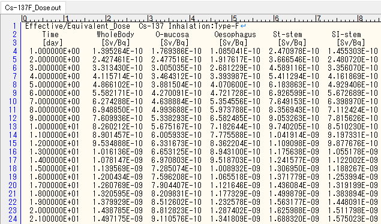
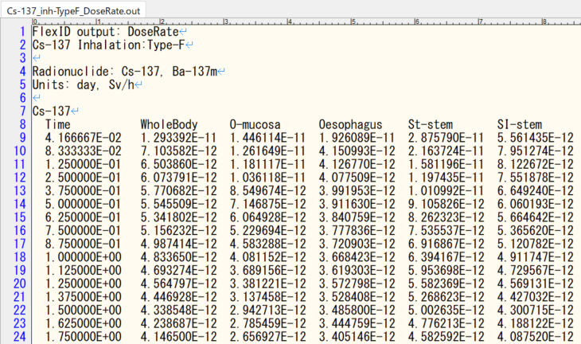
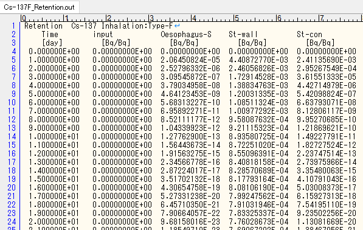
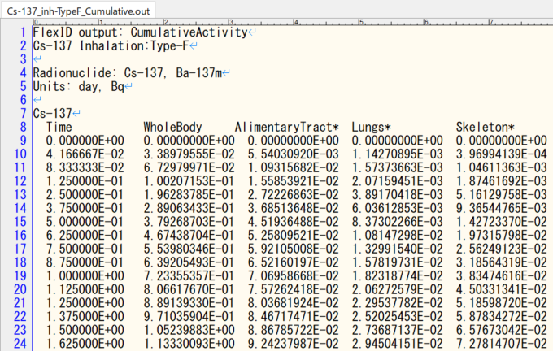

# 添付資料5 「出力ファイルの仕様」

# 1. 出力ファイルの仕様

FlexIDの各出力ファイルの仕様を示す。

## ① 実効線量/等価線量出力（Cs-137 F(入力画面「Output File Path」で指定)_Dose.out）

時系列の実効線量及び臓器/組織ごとの等価線量を出力する。出力内容を表1に、出力サンプルを図1に示す。

表1 出力内容(実効線量/等価線量出力ファイル)

|行番号|出力項目|備考|
|--|--|--|
|1行目|タイトル行|デフォルト表示：Effective/Equivalent_Dose ユーザー選択核種：Cs-137 ユーザー指定：Inhalation:Type-F （インプットファイルの1行目「摂取経路/化学形態等」の入力指定）|
|2行目|臓器/組織の名称|
|3行目|出力単位|
|4行目以降|(1列目)摂取後経過時間\[day] (2列目)実効線量 (3列目以降)臓器ごとの等価線量|子孫核種が存在する場合は、親核種と子孫核種の合算値を出力する。|

図1 出力サンプル(実効線量/等価線量出力ファイル)

## ② 実効線量率/等価線量率出力（Cs-137F (入力画面「Output File Path」で指定)_DoseRate.out）

時系列の毎時の実効線量率及び臓器/組織ごとの毎時の等価線量率を出力する。

出力内容を表2に、出力サンプルを図2に示す。

表2 出力内容(実効線量率/等価線量率出力ファイル)

|行番号|出力項目|備考|
|--|--|--|
|1行目|タイトル行|デフォルト表示：DoseRate ユーザー選択核種：Cs-137 ユーザー指定：Inhalation:Type-F （インプットファイルの1行目「摂取経路/化学形態等」の入力指定）|
|2行目|臓器/組織の名称|
|3行目|出力単位|
|4行目以降|(1列目)摂取後経過時間\[day] (2列目)預託線量率 (3列目以降)臓器ごとの等価線量率|子孫核種が存在する場合は、親核種と子孫核種の合算値を出力する。|

図2 出力サンプル(実効線量率/等価線量率出力ファイル)

## ③ 残留放射能出力（Cs-137 F(入力画面「Output File Path」で指定)_Retention.out）

時系列の臓器ごとの残留放射能を出力する。

出力内容を表3に、出力サンプルを図3に示す。

表3 出力内容(残留放射能出力ファイル)

|行番号|出力項目|備考|
|--|--|--|
|1行目|タイトル行|デフォルト表示：Retention ユーザー選択核種：Cs-137 ユーザー指定：Inhalation:Type-F （インプットファイルの1行目「摂取経路/化学形態等」の入力指定）|
|2行目|臓器/組織の名称|
|3行目|出力単位|
|4行目以降|(1列目)摂取後経過時間\[day] (2列目以降)臓器ごとの残留放射能|子孫核種が存在する場合は、親核種の計算結果の下方に出力される。|

図3 出力サンプル(残留放射能出力ファイル)

## ④ 積算放射能出力（Cs-137 F(入力画面「Output File Path」で指定)_Cumulative.out）

時系列の臓器ごとの累積放射能を出力する。

出力内容を表4に、出力サンプルを図4に示す。

表4 出力内容(積算放射能出力ファイル)

|行番号|出力項目|備考|
|--|--|--|
|1行目|タイトル行|デフォルト表示：CumulativeActivity ユーザー選択核種：Cs-137 ユーザー指定：Inhalation:Type-F （インプットファイルの1行目「摂取経路/化学形態等」の入力指定）|
|2行目|臓器/組織の名称|
|3行目|出力単位|
|4行目以降|(1列目)摂取後経過時間\[day] (2列目以降)臓器ごとの積算放射能|子孫核種が存在する場合は、親核種の計算結果の下方に出力される。|

図4 出力サンプル(積算放射能出力ファイル)
