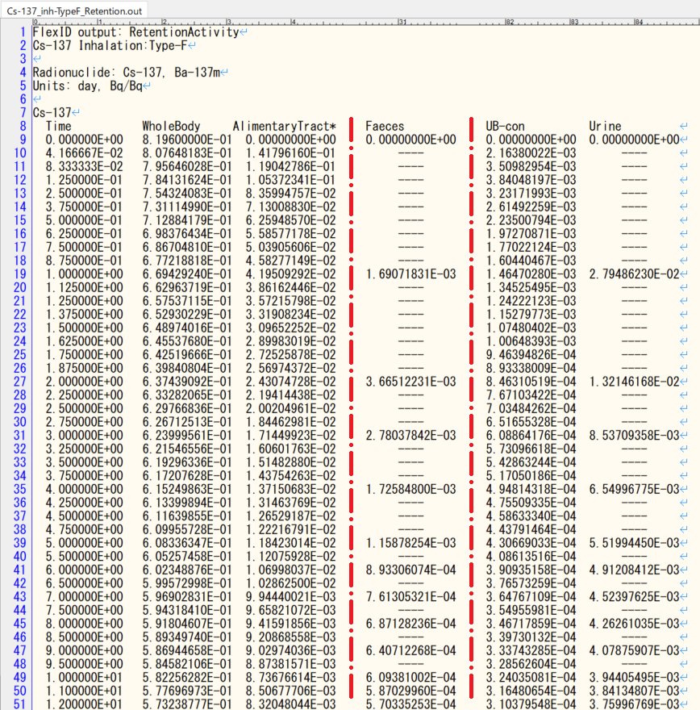

# 添付資料5 「出力ファイルの仕様」

# 1. 出力ファイルの仕様

FlexIDによって出力されるファイルの仕様を示す。

## 1.1 計算結果出力ファイル

時系列のコンパートメントごとの計算結果を出力する。拡張子は`*.out`。ファイルの先頭部分は表1に示す構造を持つ。

表1 出力ファイルの先頭部分

|行番号|出力項目|備考|
|--|--|--|
|1行目|ヘッダー行|固定文字列`FlexID output:` + ファイル種別|
|2行目|タイトル行|インプットの`title`セクションに記述された文字列|
|3行目|空行|
|4行目|対象核種|固定文字列`Radionuclide:` + インプットの`nuclide`セクションに記述された核種|
|5行目|出力単位|固定文字列`Units: ` + 出力時間メッシュと出力数値の単位|
|6行目|空行|

内容については1行目の「ファイル種別」に応じて表2に示す4つの種類がある。

表2 出力ファイルの種別

|ファイル種別|出力項目|ファイル名末尾
|--|--|--|
|`Dose`|臓器/組織ごとの実効線量及び等価線量|`_Dose.out`|
|`DoseRate`|臓器/組織ごとの実効線量率及び等価線量率|`_DoseRate.out`|
|`RetentionActivity`|コンパートメントごとの残留放射能|`_Retention.out`|
|`CumulativeActivity`|コンパートメントごとの累積放射能|`_Cumulative.out`|

計算結果は7行目以降に出力される。

なお、4行目の対象核種にて子孫核種が列挙されている場合、`Dose`と`DoseRate`では親核種と子孫核種の合算値を出力したものを親核種の計算結果として出力し、`RetentionActivity`と`CumulativeActivity`では親と子孫それぞれの核種ごとに計算結果を出力する。核種毎の出力は表3に示す構造を持つ。

表3 出力ファイルの計算結果部分

|行位置|出力項目|
|--|--|
|1行目|核種名|
|2行目|1列目:`Time`、2列目以降:各コンパートメントの名称|
|3行目以降|1列目:出力時間メッシュの終端、2列目以降:各コンパートメントの計算結果|

FlexIDの各出力ファイルのサンプルを図1～図4に示す。


図1 実効線量/等価線量出力ファイルのサンプル


図2 実効線量率/等価線量率出力ファイルのサンプル


図3 残留放射能出力ファイルのサンプル


図4 積算放射能出力ファイルのサンプル

## 1.1.1 残留放射能のOIR互換値出力機能

FlexIDでは、残留放射能の出力ファイル(ファイル種別: `RetentionActivity`、ファイル名末尾: `_Retention.out`)において、ICRP Electronic Annex OIR Data Viewerにおける排泄コンパートメントの出力値と比較可能な数値を出力する機能を持つ。本機能はインプットにおいて`Urine`と`Faeces`という名前が設定された`exc`コンパートメントに適用され、出力値に対して以下に示す処理が実施される。

- 24時間分の残留放射能値の出力処理

    前回の数値出力時刻から24時間が経過していない出力時間メッシュ位置では、計算値の代わりに`----`を出力する。24時間経過した位置では、24時間分の平均残留放射能を出力する。出力時間メッシュが24時間を超えている場合は、その時間メッシュの初期から末期24時間前までの計算結果を処理せず、最後の24時間分のみの平均残留放射能を出力する。



図5 残留放射能出力ファイルにおける`Urine`と`Faeces`の出力例

## 1.2 計算ログ出力ファイル

FlexIDによる計算処理に伴う各種のエコーバックを出力する。

現在は、核種毎に計算された線源領域`Other`の内訳と、計算されたS-Coefficientを出力する。拡張子は`*.log`。

以下に出力サンプルを示す。

```

Nuclide: Sr-90

Source regions those are part of 'Other':
O-mucosa,Teeth-V,Tonsils,Oesophag-w,St-wall,SI-wall,RC-wall,LC-wall,RS-wall,LN-ET,LN-Th,Adrenals,R-marrow,Y-marrow,Brain,Breast,Eye-lens,GB-wall,Ht-wall,Kidneys,Liver,LN-Sys,Ovaries,Pancreas,P-gland,Prostate,S-glands,Skin,Spleen,Testes,Thymus,Thyroid,Ureters,UB-wall,Uterus,Adipose,Cartilage,Muscle,ET1-wall,ET2-wall,Lung-Tis

S-Coefficient values from 'Other' to each target regions:
  T/S      Other         
O-mucosa   5.40667026E-16
Oesophagus 3.93365274E-16
St-stem    3.42421736E-16
SI-stem    3.61799914E-16
RC-stem    4.08234108E-16
LC-stem    4.07251755E-16
RS-stem    4.11499551E-16
ET1-bas    2.05206024E-16
ET2-bas    2.14196799E-16
LN-ET      5.48730668E-16
Bronch-bas 5.20567632E-16
Bronch-sec 5.15159528E-16
Bchiol-sec 2.96787210E-16
AI         2.55230789E-16
LN-Th      5.27250549E-16
R-marrow   4.69758514E-16
Endost-BS  3.54034776E-16
Brain      5.40737088E-16
Eye-lens   4.98164264E-16
P-gland    5.29974474E-16
Tongue     2.02031997E-16
Tonsils    5.38824508E-16
S-glands   5.42443915E-16
Thyroid    4.91326661E-16
Breast     5.44104124E-16
Thymus     5.39109327E-16
Ht-wall    4.72151852E-16
Adrenals   4.67745713E-16
Liver      4.35406867E-16
Pancreas   4.63272887E-16
Kidneys    4.27901835E-16
Spleen     3.84599919E-16
GB-wall    5.04373337E-16
Ureters    5.37783369E-16
UB-wall    5.25767723E-16
Ovaries    2.85852696E-16
Testes     2.41107030E-16
Prostate   2.45051184E-16
Uterus     2.98032379E-16
LN-Sys     5.20995556E-16
Skin       5.05265549E-16
Adipose    5.58775095E-16
Muscle     5.48787657E-16

Nuclide: Y-90

Source regions those are part of 'Other':
O-mucosa,Teeth-V,Tonsils,Oesophag-w,St-wall,SI-wall,RC-wall,LC-wall,RS-wall,LN-ET,LN-Th,Adrenals,R-marrow,Y-marrow,Brain,Breast,Eye-lens,GB-wall,Ht-wall,LN-Sys,Ovaries,Pancreas,P-gland,Prostate,S-glands,Skin,Spleen,Testes,Thymus,Thyroid,Ureters,UB-wall,Uterus,Adipose,Cartilage,Muscle,ET1-wall,ET2-wall,Lung-Tis

S-Coefficient values from 'Other' to each target regions:
  T/S      Other         
O-mucosa   2.24052886E-15
Oesophagus 1.76919334E-15
St-stem    1.65973540E-15
SI-stem    1.65667159E-15
RC-stem    1.54914759E-15
LC-stem    1.56213668E-15
RS-stem    1.51783686E-15
ET1-bas    1.05905441E-15
ET2-bas    1.29614873E-15
LN-ET      2.93642189E-15
...
```