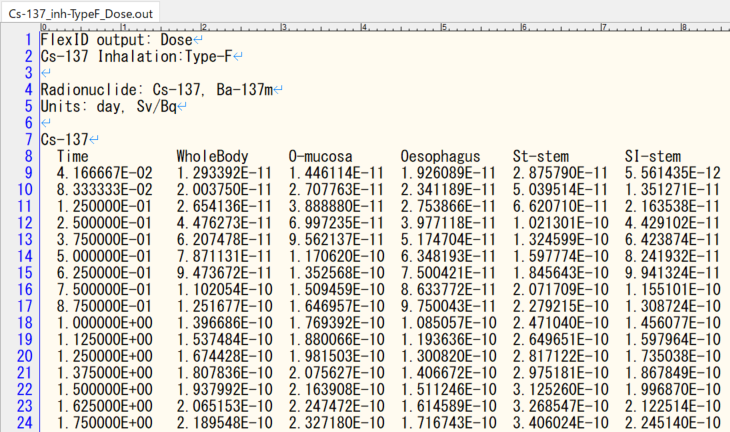
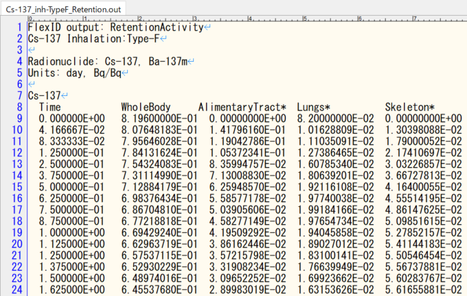

# 添付資料5 「出力ファイルの仕様」

# 1. 出力ファイルの仕様

FlexIDの各出力ファイルの仕様を示す。

## ① 実効線量/等価線量出力（Cs-137 F(入力画面「Output File Path」で指定)_Dose.out）

時系列の実効線量及び臓器/組織ごとの等価線量を出力する。出力内容を表1に、出力サンプルを図1に示す。

表1 出力内容(実効線量/等価線量出力ファイル)

|行番号|出力項目|備考|
|--|--|--|
|1行目|タイトル行|デフォルト表示：Effective/Equivalent_Dose<br>ユーザー選択核種：Cs-137<br>ユーザー指定：Inhalation:Type-F<br>（インプットファイルの1行目「摂取経路/化学形態等」の入力指定）|
|2行目|臓器/組織の名称|
|3行目|出力単位|
|4行目以降|(1列目)摂取後経過時間\[day]<br>(2列目)実効線量<br>(3列目以降)臓器ごとの等価線量|子孫核種が存在する場合は、親核種と子孫核種の合算値を出力する。|



図1 出力サンプル(実効線量/等価線量出力ファイル)

## ② 実効線量率/等価線量率出力（Cs-137F (入力画面「Output File Path」で指定)_DoseRate.out）

時系列の毎時の実効線量率及び臓器/組織ごとの毎時の等価線量率を出力する。

出力内容を表2に、出力サンプルを図2に示す。

表2 出力内容(実効線量率/等価線量率出力ファイル)

|行番号|出力項目|備考|
|--|--|--|
|1行目|タイトル行|デフォルト表示：DoseRate<br>ユーザー選択核種：Cs-137<br>ユーザー指定：Inhalation:Type-F<br>（インプットファイルの1行目「摂取経路/化学形態等」の入力指定）|
|2行目|臓器/組織の名称|
|3行目|出力単位|
|4行目以降|(1列目)摂取後経過時間\[day]<br>(2列目)預託線量率<br>(3列目以降)臓器ごとの等価線量率|子孫核種が存在する場合は、親核種と子孫核種の合算値を出力する。|


図2 出力サンプル(実効線量率/等価線量率出力ファイル)

## ③ 残留放射能出力（Cs-137 F(入力画面「Output File Path」で指定)_Retention.out）

時系列の臓器ごとの残留放射能を出力する。

出力内容を表3に、出力サンプルを図3に示す。

表3 出力内容(残留放射能出力ファイル)

|行番号|出力項目|備考|
|--|--|--|
|1行目|タイトル行|デフォルト表示：Retention<br>ユーザー選択核種：Cs-137<br>ユーザー指定：Inhalation:Type-F<br>（インプットファイルの1行目「摂取経路/化学形態等」の入力指定）|
|2行目|臓器/組織の名称|
|3行目|出力単位|
|4行目以降|(1列目)摂取後経過時間\[day]<br>(2列目以降)臓器ごとの残留放射能|子孫核種が存在する場合は、親核種の計算結果の下方に出力される。|



図3 出力サンプル(残留放射能出力ファイル)

## ④ 積算放射能出力（Cs-137 F(入力画面「Output File Path」で指定)_Cumulative.out）

時系列の臓器ごとの累積放射能を出力する。

出力内容を表4に、出力サンプルを図4に示す。

表4 出力内容(積算放射能出力ファイル)

|行番号|出力項目|備考|
|--|--|--|
|1行目|タイトル行|デフォルト表示：CumulativeActivity<br>ユーザー選択核種：Cs-137<br>ユーザー指定：Inhalation:Type-F<br>（インプットファイルの1行目「摂取経路/化学形態等」の入力指定）|
|2行目|臓器/組織の名称|
|3行目|出力単位|
|4行目以降|(1列目)摂取後経過時間\[day]<br>(2列目以降)臓器ごとの積算放射能|子孫核種が存在する場合は、親核種の計算結果の下方に出力される。|


図4 出力サンプル(積算放射能出力ファイル)

## ⑤ 計算ログ出力

FlexIDによる計算処理に伴う各種のエコーバックを出力する。

現在は、核種毎に計算された線源領域`Other`の内訳と、計算されたS-Coefficientを出力する。

以下に出力サンプルを示す。

```

Nuclide: Sr-90

Source regions those are part of 'Other':
O-mucosa,Teeth-V,Tonsils,Oesophag-w,St-wall,SI-wall,RC-wall,LC-wall,RS-wall,LN-ET,LN-Th,Adrenals,R-marrow,Y-marrow,Brain,Breast,Eye-lens,GB-wall,Ht-wall,Kidneys,Liver,LN-Sys,Ovaries,Pancreas,P-gland,Prostate,S-glands,Skin,Spleen,Testes,Thymus,Thyroid,Ureters,UB-wall,Uterus,Adipose,Cartilage,Muscle,ET1-wall,ET2-wall,Lung-Tis

S-Coefficient values from 'Other' to each target regions:
  T/S      Other         
O-mucosa   5.40667026E-16
Oesophagus 3.93365274E-16
St-stem    3.42421736E-16
SI-stem    3.61799914E-16
RC-stem    4.08234108E-16
LC-stem    4.07251755E-16
RS-stem    4.11499551E-16
ET1-bas    2.05206024E-16
ET2-bas    2.14196799E-16
LN-ET      5.48730668E-16
Bronch-bas 5.20567632E-16
Bronch-sec 5.15159528E-16
Bchiol-sec 2.96787210E-16
AI         2.55230789E-16
LN-Th      5.27250549E-16
R-marrow   4.69758514E-16
Endost-BS  3.54034776E-16
Brain      5.40737088E-16
Eye-lens   4.98164264E-16
P-gland    5.29974474E-16
Tongue     2.02031997E-16
Tonsils    5.38824508E-16
S-glands   5.42443915E-16
Thyroid    4.91326661E-16
Breast     5.44104124E-16
Thymus     5.39109327E-16
Ht-wall    4.72151852E-16
Adrenals   4.67745713E-16
Liver      4.35406867E-16
Pancreas   4.63272887E-16
Kidneys    4.27901835E-16
Spleen     3.84599919E-16
GB-wall    5.04373337E-16
Ureters    5.37783369E-16
UB-wall    5.25767723E-16
Ovaries    2.85852696E-16
Testes     2.41107030E-16
Prostate   2.45051184E-16
Uterus     2.98032379E-16
LN-Sys     5.20995556E-16
Skin       5.05265549E-16
Adipose    5.58775095E-16
Muscle     5.48787657E-16

Nuclide: Y-90

Source regions those are part of 'Other':
O-mucosa,Teeth-V,Tonsils,Oesophag-w,St-wall,SI-wall,RC-wall,LC-wall,RS-wall,LN-ET,LN-Th,Adrenals,R-marrow,Y-marrow,Brain,Breast,Eye-lens,GB-wall,Ht-wall,LN-Sys,Ovaries,Pancreas,P-gland,Prostate,S-glands,Skin,Spleen,Testes,Thymus,Thyroid,Ureters,UB-wall,Uterus,Adipose,Cartilage,Muscle,ET1-wall,ET2-wall,Lung-Tis

S-Coefficient values from 'Other' to each target regions:
  T/S      Other         
O-mucosa   2.24052886E-15
Oesophagus 1.76919334E-15
St-stem    1.65973540E-15
SI-stem    1.65667159E-15
RC-stem    1.54914759E-15
LC-stem    1.56213668E-15
RS-stem    1.51783686E-15
ET1-bas    1.05905441E-15
ET2-bas    1.29614873E-15
LN-ET      2.93642189E-15
...
```