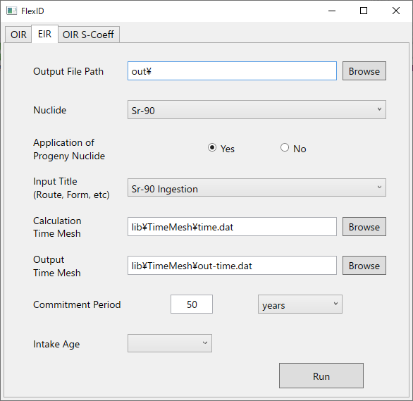
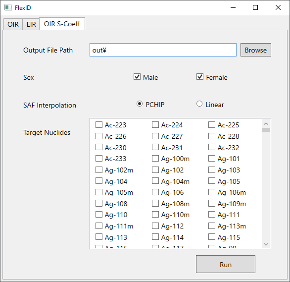
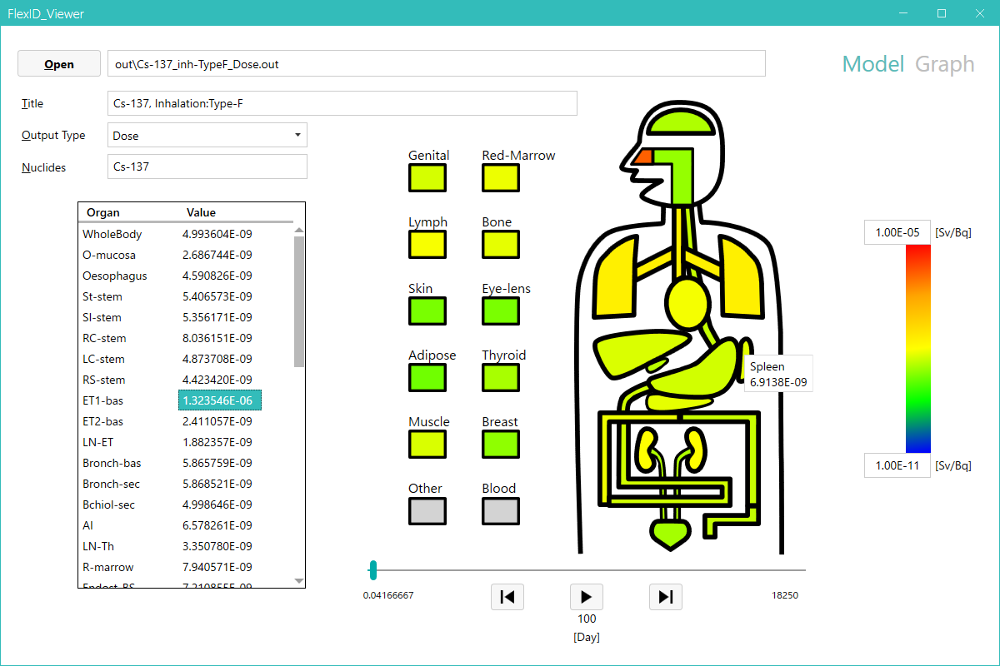

# 1. はじめに

本書は、ICRP2007年勧告に基づく内部被ばく線量評価コードFlexID（Flexible code for Internal Dosimetry）のユーザーマニュアルである。FlexIDは、ICRP2007年勧告に基づく体内動態モデルを臓器・組織ごとに組合せ、放射性核種の人間の体内での移行を計算し、子孫核種も含めた体内動態、及び線量評価を行う。入力データの変更だけで体内動態モデルの組合せや移行係数等を変更でき、ICRPの体内動態モデルの変更に迅速かつ容易に対応可能な汎用コードである。

# 2. 動作環境

プログラムの動作環境を以下に示す。

- .NET Framework 4.6.2以降がインストール済みのWindows OSパソコン

# 3. 開発環境

プログラムの開発環境を以下に示す。

- OS：Windows 10
- IDE：Microsoft Visual Studio 2022
- 使用言語：C#
- 対象フレームワーク：.NET Framework 4.6.2

# 4. 導入方法

FlexIDフォルダを任意の場所にコピーすることでFlexIDプログラムを導入できる。以下にFlexIDフォルダの構成を示す。

```
FlexID
  ┣ inp
  ┃  ┣ EIR
  ┃  ┃  ┗ 元素ごとの公衆の構成員（EIR）に対するインプットファイル
  ┃  ┗ OIR
  ┃     ┗ 元素ごとの職業人（OIR）に対するインプットファイル
  ┃
  ┣ lib
  ┃  ┣ EIR
  ┃  ┃  ┗ 元素ごとのEIRに対するSEEファイル
  ┃  ┗ OIR
  ┃     ┗ 元素ごとのOIRに対するS-Coefficientファイル
  ┃
  ┣ FlexID.Calc.exe（残留放射能・線量計算プログラム：ユーザーは使用しない）
  ┃
  ┣ FlexID.exe（入力画面プログラム）
  ┗ FlexID.Viewer.exe（出力画面プログラム）
```

※ 以下のファイルは、ユーザーの責任において入手してlibフォルダ直下に配置して使用する。

- ICRP Publication 107 Supplemental Materialから入手
  - ICRP-07.RAD
  - ICRP-07.BET
- ICRP Publication 133 Supplemental Material から入手
  - rcp-am_alpha_2017-03-07.SAF
  - rcp-af_alpha_2017-03-07.SAF
  - rcp-am_electron_2017-03-07.SAF
  - rcp-af_electron_2017-03-07.SAF
  - rcp-am_neutron_2017-03-07.SAF
  - rcp-af_neutron_2017-03-07.SAF
  - rcp-am_photon_2017-03-07.SAF
  - rcp-af_photon_2017-03-07.SAF
  - sregions_2016-08-12.NDX
  - torgans_2016-08-12.NDX

# 5. 主な機能

FlexID の主な機能を以下に示す。

- 臓器／組織ごとの残留・積算放射能量の計算（[添付資料1](UserManual_Appendix-1.md) 参照）
- 臓器／組織ごとの等価線量、積算線量、及び線量率の計算（[添付資料2](UserManual_Appendix-2.md) 参照）
- 預託実効線量、積算線量、及び線量率の計算（[添付資料2](UserManual_Appendix-2.md) 参照）
- 核種ごとのS-Coefficientの計算（[添付資料3](UserManual_Appendix-3.md) 参照）

# 6. 入力画面の操作方法

`FlexID\FlexID.exe`をダブルクリックする。


- ① 被ばく対象のタブを選択する。

   - OIR：職業人の内部被ばく（Occupational Intakes of Radionuclides）
   - EIR：公衆の構成員の内部被ばく（Environmental Intakes of Radionuclides）

# 7. OIR計算実行画面


新しい核種を追加するためのインプットファイル作成方法は、[添付資料4](UserManual_Appendix-4.md)を参照。

- ① 出力フォルダパスおよび出力ファイルの先頭につく共通ファイル名を記載する。

  例：`C:\AAA\BBB\CCC\Sr-90_ing`と入力した場合、`C:\AAA\BBB\CCC`フォルダに以下の5つのファイルが出力される（[添付資料5](UserManual_Appendix-5.md) 参照）。

    ```
    Sr-90_ing _Cumulative.out
    Sr-90_ing _Dose.out
    Sr-90_ing _DoseRate.out
    Sr-90_ing _Retention.out
    Sr-90_ing .log
    ```

  拡張子は自動で設定されるため設定は不要。

- ② コンボボックスの中から計算対象核種を選択する。

- ③ 子孫核種の考慮の有無を選択する。

- ④ コンボボックスの中から摂取経路及び化学形態を選択する。

- ⑤ 計算タイムメッシュファイルを選択する。

- ⑥ 出力タイムメッシュファイルを選択する。

- ⑦ 預託期間を整数で入力後、コンボボックスの中から預託期間の単位を選択する

    計算タイムメッシュファイルの作成方法：[添付資料4](UserManual_Appendix-4.md)参照

    出力タイムメッシュファイルの作成方法：[添付資料4](UserManual_Appendix-4.md)参照

# 8. EIR計算実行画面



- ① 出力フォルダパスおよび出力ファイルの先頭につく共通ファイル名を記載する。

    例：`C:\AAA\BBB\CCC\test`と入力した場合、`C:\AAA\BBB\CCC`フォルダに以下の4つのファイルが 出力される（[添付資料5](UserManual_Appendix-5.md)参照）

    ```
    test_Cumulative.out
    test_Dose.out
    test_DoseRate.out
    test_Retention.out
    ```

    拡張子は自動で設定されるため設定は不要。

- ② コンボボックスの中から計算対象核種を選択する。

- ③ 子孫核種の考慮の有無を選択する。

- ④ コンボボックスの中から摂取経路及び化学形態を選択する。

- ⑤ 計算タイムメッシュファイルを選択する。

- ⑥ 出力タイムメッシュファイルを選択する。

- ⑦ 預託期間を整数で入力後、コンボボックスの中から預託期間の単位を選択する。

- ⑧ コンボボックスの中から被ばく時の年齢（摂取時年齢）を選択する。

# 9. S係数作成画面



- ① 出力フォルダパスを記載する。

- ② 出力対象の性別として、男性、女性を選択する。

- ③ SAF値の補間方法として、PCHIP（区分的3次エルミート内挿多項式）による補間、または線形補間を選択する。

- ④ 出力対象の核種にチェックを入れて選択する。

# 10. 結果表示画面(Model)の説明



- ① 結果表示のために読み込むファイルを選択する。

- ② コンボボックスの中から表示するデータを選択する。

    |項目|説明|
    |:---|:---|
    |Retention|単位摂取放射能量（1 [Bq]）当たり、計算時間ステップ当たりの残留放射能量 [－]|
    |CumulativeActivity|臓器/組織ごとの積算残留放射能量 [Bq]|
    |Dose|等価線量 [Sv/Bq]|
    |DoseRate|等価線量率 [Sv/Bq/h]|

- ③ 対象時刻の計算結果のデジタル値を表示する。

- ④ ボタン操作により体内を模擬したコンター図の動画が表示される。

- ⑤ 臓器/組織ごとのデータをコンター表示する。

- ⑥ コンターの閾値を設定する。

なお、計算済みの結果を表示する場合は、`FlexID\FlexID.Viewer.exe`をダブルクリックする。

# 11. 結果表示画面(Graph)の説明


- ① コンボボックスの中から表示するデータを選択する。
    
    |項目|説明|
    |:---|:---|
    |Retention|単位摂取放射能量（1 [Bq]）当たり、計算時間 ステップ当たりの残留放射能量 [－]|
    |CumulativeActivity|臓器/組織ごとの積算残留放射能量 [Bq]|
    |Dose|等価線量 [Sv/Bq]|
    |DoseRate|等価線量率 [Sv/Bq/h]|

- ② 表示したい臓器にチェックを入れ、「Plot」ボタンをクリックする。

- ③ ②で選択された臓器の計算結果の摂取後の時系列データが表示される。

- ④ 軸のオプションを選択する。（ 線形(Linear)表示 と 対数(Log)表示 の切り替え ）

グラフ画面において、マウスによるドラッグやスクロールにより、グラフの移動、拡大縮小、軸レンジの変更が行える。また、グラフ画面の変更後に再度「Plot」ボタンをクリックすると、全てのプロットデータの収まる最小範囲の軸レンジによる表示に戻る。

|マウス操作|動作|
|:--|:--|
|軸位置でスクロール|軸レンジの拡大縮小|
|グラフエリア内でのスクロール|グラフ全体の拡大縮小|
|プロット上で左クリック|対象臓器名称とデジタル値の表示|
|右ドラッグ|グラフデータ全体の移動|
|ホイールボタンによる範囲選択|選択範囲内の拡大表示|
|ホイールボタンのダブルクリック|全てのプロットデータの収まる最小範囲の軸（=「Plot」ボタン押下） レンジによる表示|
